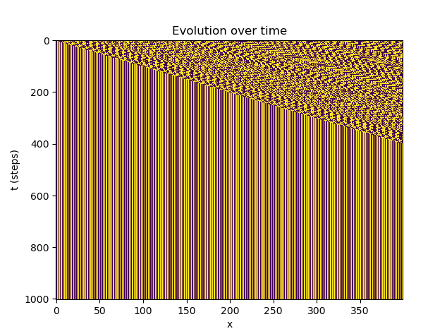

Caching intermediate results
============================

Sometimes when performing complex simulations micromodels are run with the same
data more than once and it can be useful to cache the results to save computing
time.

A simple caching component can be found in the ``examples/python`` folder named
``cache.py``. This cache can be inserted between two models to cache results from
the micro model.

.. literalinclude:: examples/ecac_python.ymmsl
  :caption: ``docs/source/examples/ecac_python``
  :language: yaml

The cache can be used by inserting it between two components, attach the ``back``
side to the model you want cached, and the ``front`` to the caller.

One setting is available for the cache, determining how many responses the cache
will remember. Setting this too high for data-intensive applications will result
in a lot of memory usage. If this setting is not set a cache size of ``128`` is
used.

.. literalinclude:: examples/eca_settings.ymmsl
  :caption: ``docs/source/examples/eca_settings.ymmsl``
  :language: yaml

Example caching results
-----------------------

An example elementary cellular automata can be run with and without cache to see
the impact.

To run the examples with and without cache you can execute the following

.. code-block:: bash

  # without cache
  muscle_manager --start-all eca_implementations.ymmsl eca_python.ymmsl eca_settings.ymmsl
  # with cache
  muscle_manager --start-all eca_implementations.ymmsl ecac_python.ymmsl eca_settings.ymmsl

.. list-table::

  * - .. figure:: plot_performance_timeline_no_cache.png
        :width: 100%

        timeline without cache
    - ..  figure:: plot_performance_timeline_cache.png
        :width: 100%

        timeline with cache

As you can see after 1.25 seconds the simulation reached a stable state, and the cache takes over
from the micromodel, saving compute time in the process

  cellular automata simulation

The simulations finds a stable state after 400~ iterations, after which the cache can take over from the micro model
