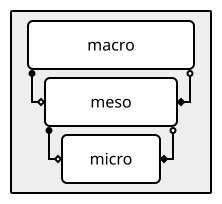
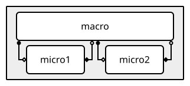
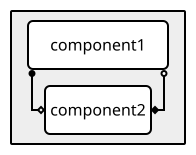
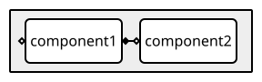
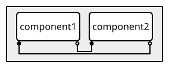
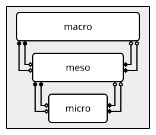
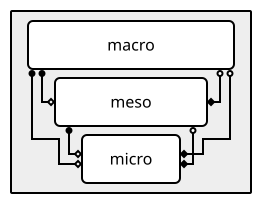

Coupling your model
===================

Timelines
---------

Different components of a coupled simulation typically run at their own pace:
a fast, detailed micro model may take many small steps for every single step
of the macro model driving it, while a meso model may sit somewhere in
between the two. MUSCLE3 calls this idea of "running at a different pace" a
*timeline*.

Every port lives on a timeline, and two rules decide which one: a
component's ``F_INIT`` and ``O_F`` ports always live on the same timeline as
the component itself, while its ``O_I`` and ``S`` ports, if it has any, live
one level deeper, on one or more subtimelines nested inside it. Whatever
component is called through one of those subtimelines' ``O_I``/``S`` ports (i.e.
whose ``F_INIT``/``O_F`` ports are connected to them) has its own
``F_INIT``/``O_F`` right there on that same subtimeline, and if it in turn has
its own ``O_I``/``S`` loop, that one is nested one level deeper still, nesting
one level for every loop in the chain.

Take a macro model that calls a meso model in a loop, where that meso model in
turn calls a micro model in its own loop:



Nesting in the figure mirrors nesting in time: ``meso``'s box sits inside
``macro``'s, and ``micro``'s sits inside ``meso``'s.

Applying the two rules above gives three timelines: the root timeline ``:``
(where ``macro``'s ``F_INIT``/``O_F`` would be, if it had any), ``:macro``
(``meso``'s ``F_INIT``/``O_F``, and ``macro``'s ``O_I``/``S`` one level
deeper), and ``:macro:meso`` (``micro``'s ``F_INIT``/``O_F``, and ``meso``'s
``O_I``/``S`` one level deeper still). yMMSL works this out automatically
from how components are wired together with conduits.

A component isn't limited to driving a single loop, either: it can own more
than one independent ``O_I``/``S`` subtimeline at once, for example when it
calls two other components that run at different rates. Take ``macro``
driving ``micro1`` and ``micro2`` each in their own loop:



``macro``'s two subtimelines are drawn side by side beneath it, each with
its own pair of ports, one leading to ``micro1`` and the other to
``micro2``. ``micro1`` and ``micro2`` end up on two independent
subtimelines nested inside ``macro``'s own (``:macro.tl1`` and
``:macro.tl2``) rather than a shared one, so they can each run at their
own pace without interfering with each other.

.. seealso::

   yMMSL documentation on :external+ymmsl:ref:`Timelines` for how to declare
   a ``timeline <name>:`` heading in a yMMSL file.


Types of coupling
------------------

MUSCLE3 distinguishes three ways in which two components can be coupled:
*call/release*, *dispatch*, and *interact*. Each one also has a direct
consequence for timelines, from sharing a single timeline to nesting one inside
the other, noted below for each.


Call/release coupling
``````````````````````

The most common pattern: Component 1's ``O_I``/``S`` ports are wired to
Component 2's ``F_INIT``/``O_F`` ports. Component 1 calls Component 2 once
per iteration, waits for its result, and continues. This is the pattern that
creates a nested one, as described above, Component 2 lives one level deeper,
on the subtimeline Component 1's loop opens.




Dispatch coupling 
``````````````````

Component 1's ``O_F`` port connects directly to Component 2's ``F_INIT``
port: Component 2's single run is dispatched once Component 1 finishes,
rather than being called repeatedly from inside a loop. This is how you
build a pipeline of components that each run once, in sequence, so they
live in the same timeline.




Interact coupling and timeline bridges
`````````````````````````````````````````

Two components can also interact as peers: Component 1's ``O_I`` port
connects to Component 2's ``S`` port, and Component 2's ``O_I`` connects
back to Component 1's ``S``. By default each component's ``O_I``/``S`` pair
opens its *own* new subtimeline, nested inside that component's own. Component
1 and Component 2 would end up on two different subtimelines and MUSCLE3 would
reject the conduits between them. To actually share one, both need the same
explicit ``timeline <name>:`` heading grouping these ports.

Both components have to send on their ``O_I`` port before either receives on
``S``. If both components take steps at exactly the same pace, this works in
lock-step, every send on one side is matched by a receive on the other, one
message at a time:


         component2's O_I port connects back to component1's S port, both
         inside a single shared timeline.

.. note::

   ``ymmsl2svg`` cannot yet render this coupling shape (it raises
   ``NotImplementedError: Visualization for interact coupling is not yet
   implemented.``), so there's no figure here for now — see the ASCII-art
   timelines in :ref:`Interact coupling` and in
   :ref:`Consistency for simulation time checkpoints` for a byte-level view of
   how a bridge's messages interleave with its two peers.

A bridge component groups its ports under two ``timeline <name>:`` headings,
exactly like the independent-sub-timelines case above, except that here each
sub-timeline is driven by a *different* peer component rather than both being
driven by the bridge itself:

.. code-block:: yaml
    :caption: yMMSL for a timeline bridge connecting two peers, ``left`` and ``right``

    components:
      left:
        ports:
          o_i: boundary_out
          s: boundary_in
        implementation: model
      right:
        ports:
          o_i: boundary_out
          s: boundary_in
        implementation: model
      coupler:
        ports:
          timeline left:
            o_i: a_out
            s: a_in
          timeline right:
            o_i: b_out
            s: b_in
        implementation: temporal_coupler
    conduits:
      left.boundary_out: coupler.a_in
      right.boundary_out: coupler.b_in
      coupler.a_out: left.boundary_in
      coupler.b_out: right.boundary_in

``coupler`` shares one subtimeline with ``left`` and a separate, independent
one with ``right`` — the same as the two-independent-loops case earlier,
except each subtimeline is led by the peer's send rather than the bridge's.
``left`` and ``right`` themselves never share a timeline at all; the bridge
is the only thing connecting them.

Unlike call/release or dispatch, a bridge's implementation does not have
clearly separated ``O_I`` and ``S`` phases: it sends and receives in whatever
order is needed to keep both peers fed, based on the timestamps carried in
their messages. ``docs/source/examples/python/interact_coupling.py`` in the
MUSCLE3 source contains a complete, runnable example of exactly this
component (``temporal_coupler``), including a small ``DataCache`` that
interpolates between the two most recent messages from a peer. Its main loop:

.. literalinclude:: examples/python/interact_coupling.py
   :pyobject: temporal_coupler

**Why the bridge must receive first.** A sub-timeline is led by whichever
operation happens first on it: if a component's first action on a
sub-timeline is a *send* on ``O_I``, that sub-timeline becomes "O_I-led" and
every following sub-iteration must go ``O_I`` then ``S``; if its first action
is instead a *receive* on ``S``, the sub-timeline becomes "S-led" and the
order flips to ``S`` then ``O_I``. A bridge has nothing to send until it knows
what its peer's first message looks like, so it must receive before it sends
on each of its sub-timelines — the ``Peer`` class in the example above does
exactly this in its constructor, receiving an initial message before the main
loop ever calls ``send``:

.. literalinclude:: examples/python/interact_coupling.py
   :pyobject: Peer.__init__

If a bridge implementation sent first by mistake, that sub-timeline would
become O_I-led, and the subsequent receive that establishes the peer's
initial state would be rejected with a ``PortBlocked`` error rather than
silently doing the wrong thing.


Send/receive order
-------------------

Placing ports on timelines like this isn't just bookkeeping: it also fixes
the order in which a component is allowed to call ``send``/``receive`` on
them. A component first receives once on each of its ``F_INIT`` ports, then works
through every ``O_I``/``S`` subtimeline it drives. A subtimeline doesn't
have to be used on every iteration, though: a component may skip one
entirely, going straight from ``F_INIT`` to ``O_F`` without ever sending or
receiving on it, but once it does send or receive a message on a
subtimeline, it has to finish it: every port on that subtimeline must have
sent or received a message before it counts as done. In the two-subtimeline
example above, ``macro`` could, say, run its ``tl1`` loop with ``micro1``
on every iteration of its own outer loop, but only run ``tl2`` with
``micro2`` on some of them, skipping it on the rest.

Each subtimeline fixes its own order independently of the others: whichever
action a component performs first on it, sending on ``O_I`` or receiving on
``S``, decides the order, sending on every ``O_I`` port before receiving on any
``S`` port, or the other way around, receiving on every ``S`` port before
sending on any ``O_I`` port. In the macro/meso/micro example above, every
subtimeline happens to start with a send: ``macro`` sends on ``O_I`` before it
ever receives on ``S``, and ``meso`` and ``micro`` each do the same one level
down. The two-subtimeline example above makes the same choice for both of
``macro``'s loops. Starting with a receive instead of a send is what a
**timeline bridge** does instead, see
:ref:`Interact coupling and timeline bridges` above.

Only once a component is done with every subtimeline it drives, does it send on
its ``O_F`` ports.

A component that calls send/receive out of that order, e.g. sending twice
on ``O_I`` before ``S`` has replied, or sending on ``O_F`` before every
subtimeline has finished, gets a clear error explaining what it was
expected to do instead.


Putting it together
--------------------

A larger example ties everything above together: extend the macro/meso/micro
chain with a second micro, so ``meso`` drives both ``micro`` and ``micro2``,
each in its own loop:

.. figure:: timelines_combined_example.svg
   :align: center

   ``meso`` is nested one level inside ``macro``, exactly as before; its two
   subtimelines, one per micro, are then nested one level inside ``meso`` in
   turn, drawn side by side.

This single model combines everything covered above:

- ``macro`` calls ``meso`` via call/release coupling, so ``meso`` (and
  everything it drives) is nested one level inside ``macro``'s timeline,
  ``:macro``.
- ``meso`` in turn calls both ``micro`` and ``micro2``, each in its own
  loop, so they end up on two independent subtimelines nested inside
  ``meso``'s own: ``:macro:meso.tl1`` for ``micro`` and
  ``:macro:meso.tl2`` for ``micro2``.
- Both of those subtimelines happen to be led by a send here, since
  ``meso`` sends before it ever receives on either of them, but as covered
  in `Send/receive order`_, that's a choice made independently for each
  subtimeline, not a requirement.
- ``meso`` doesn't have to run both loops on every one of its own
  iterations either: it could run its ``micro`` loop every time while only
  occasionally running its ``micro2`` loop, skipping the latter on the
  rest, exactly as described above.

Everything MUSCLE3 checks — which timeline each port lives on, and in what
order sends and receives on it are allowed — falls out of this wiring
automatically; nothing here needs to be declared explicitly beyond the
``timeline tl1:``/``timeline tl2:`` headings on ``meso``'s ports.


Multicast
---------

With MUSCLE3 you can connect an output port to multiple input ports.
When a submodel sends a message on a port that is connected to
multiple input ports, the message is copied and sent to each connected port.

.. note::

    It is not allowed to connect multiple output ports to a single input port.

Example
```````

.. tabs::

    .. code-tab:: yaml Basic macro/micro model configuration

        ymmsl_version: v0.2
        models:
          multicast:
            components:
              macro:
                description: A macro model
                implementation: macro
              micro:
                description: A micro model
                implementation: micro
            conduits:
              macro.state_out: micro.state_in
              micro.state_out: macro.state_in

    .. code-tab:: yaml Extended configuration with multicast

        ymmsl_version: v0.2
        models:
          multicast:
            components:
              macro:
                description: A macro model
                implementation: macro
              micro:
                description: A micro model
                implementation: micro
              printer:
                description: Prints messages for debugging
                implementation: printer
            conduits:
              macro.state_out: micro.state_in
              micro.state_out:
              - macro.state_in
              - printer.in

In the second tab, a new component `printer` is added and wired to the
``state_out`` port of the micro model. Whenever the micro model sends a message
on that port, one copy is sent to the macro model to continue the simulation.
Another copy is sent to the printer component, which (for example) prints a
summary of the state.


Conduit filters
----------------

Recall from `Timelines`_ that every port lives on a timeline, and that an
ordinary conduit connects two ports that live on the same one, that's what
call/release and dispatch coupling do. When you want to connect two ports
that live on different timelines instead, without the message being relayed
through whatever sits between them, you can connect them with a conduit
filter.

Extending the macro-meso-micro example above: the conduit from ``macro`` to
``meso``, and the one from ``meso`` to ``micro``, each connect ports that
live on the same timeline, ``macro``'s ``O_I``/``S`` and ``meso``'s
``F_INIT``/``O_F`` both live on ``:macro``, and ``meso``'s ``O_I``/``S`` and
``micro``'s ``F_INIT``/``O_F`` both live on ``:macro:meso``.

Now say ``macro`` produces a message that ``micro`` needs directly, with
``meso`` doing nothing with it along the way. Without conduit filters, we'd
have to route it through ``meso``: give ``meso`` extra ports, and write code
that takes the single message it gets on ``bypass_in`` and resends it to
``micro`` on every one of ``meso``'s calls to it, and takes the many messages
``micro`` sends back and forwards only the last one to ``macro``:


         relay port pair on meso, instead of being connected to each other.


A conduit filter lets us skip ``meso`` and that relay code entirely, by
connecting ``macro`` and ``micro`` directly instead. Since ``macro``'s
``O_I``/``S`` ports live on ``:macro`` and ``micro``'s
``F_INIT``/``O_F`` ports live on ``:macro:meso``, this conduit connects
ports that don't live on the same timeline, and the same is true the other way
around, for a message travelling from ``micro`` back to ``macro`` without going
through ``meso``. ``meso`` no longer needs the relay ports, and the only part
that changes is the ``conduits`` section:


         them, bypassing meso, labeled "repeat" and "last".


Connecting ``macro`` and ``micro`` directly means we now have to handle the
pace mismatch between them explicitly, rather than leaving it to ``meso``,
``micro`` gets called many times for every single time ``macro``
runs, so it needs many ``bypass_in`` messages for the one
``bypass_out`` message ``macro`` sends, and the other way around, ``micro``
produces many ``bypass_out`` messages while ``macro`` only needs one
``bypass_in`` message per call. A filter tells the conduit how to erpeat or
pad ``macro``'s single message to cover ``micro``'s many calls, or how to
reduce ``micro``'s many messages down to the one ``macro`` needs:

- ``repeat`` resends the single message ``macro`` sends on ``bypass_out``
  unchanged to ``micro`` on every one of its calls, until a new message
  replaces it.
- ``pad`` also passes that single message through once, but instead of
  repeating it, follows it with empty messages for ``micro``'s remaining
  calls.
- ``last`` goes the other way: of everything ``micro`` sends on
  ``bypass_out``, only the most recently sent message is delivered to
  ``macro``'s single ``bypass_in`` receive; the rest are dropped.

.. seealso::

    yMMSL documentation on :external+ymmsl:ref:`Conduit filters` for how to
    declare ``repeat``, ``pad`` and ``last`` filters in a yMMSL file.
