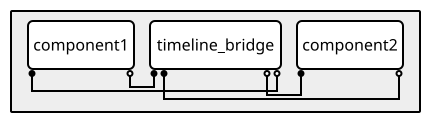

Coupling your model
===================

Multicast
---------

With MUSCLE3 you can connect an output port to multiple input ports.
When a submodel sends a message on a port that is connected to
multiple input ports, the message is copied and sent to each connected port.

.. note::

    It is not allowed to connect multiple output ports to a single input port.

Example
```````

.. tabs::

    .. code-tab:: yaml Basic macro/micro model configuration

        ymmsl_version: v0.2
        models:
          multicast:
            components:
              macro:
                description: A macro model
                implementation: macro
              micro:
                description: A micro model
                implementation: micro
            conduits:
              macro.state_out: micro.state_in
              micro.state_out: macro.state_in

    .. code-tab:: yaml Extended configuration with multicast

        ymmsl_version: v0.2
        models:
          multicast:
            components:
              macro:
                description: A macro model
                implementation: macro
              micro:
                description: A micro model
                implementation: micro
              printer:
                description: Prints messages for debugging
                implementation: printer
            conduits:
              macro.state_out: micro.state_in
              micro.state_out:
              - macro.state_in
              - printer.in

In the second tab, a new component `printer` is added and wired to the
``state_out`` port of the micro model. Whenever the micro model sends a message
on that port, one copy is sent to the macro model to continue the simulation.
Another copy is sent to the printer component, which (for example) prints a
summary of the state.

Timelines
---------

Different components of a coupled simulation typically run at their own pace:
a fast, detailed micro model may take many small steps for every single step
of the macro model driving it, while a meso model may sit somewhere in
between the two. MUSCLE3 calls this idea of "running at a different pace" a
*timeline*.

Every port lives on a timeline, and two rules decide which one:

- A component's ``F_INIT`` and ``O_F`` ports always live on the same
  timeline as the component itself.
- A component's ``O_I`` and ``S`` ports, if it has any, live one level
  deeper, on one or more subtimelines nested inside it.

These two rules chain together: whatever component is called through one of
those subtimelines (i.e. whose ``F_INIT``/``O_F`` ports are connected to a
component's ``O_I``/``S`` ports) has its own ``F_INIT``/``O_F`` right there
on that same subtimeline. If that component in turn has its own ``O_I``/``S``
loop, that loop is nested one level deeper still, one level for every loop
in the chain.

Take a macro model that calls a meso model in a loop, where that meso model in
turn calls a micro model in its own loop:

.. figure:: timelines_macro_meso_micro.svg
   :align: center

Nesting in the figure mirrors nesting in time: ``meso``'s box sits inside
``macro``'s, and ``micro``'s sits inside ``meso``'s.

Applying the two rules above gives three timelines:

- the root timeline ``:``, where ``macro``'s ``F_INIT``/``O_F`` would be, if
  it had any;
- ``:macro``, holding ``meso``'s ``F_INIT``/``O_F`` and, one level deeper,
  ``macro``'s ``O_I``/``S``;
- ``:macro:meso``, holding ``micro``'s ``F_INIT``/``O_F`` and, one level
  deeper still, ``meso``'s ``O_I``/``S``.

yMMSL works this out automatically from how components are wired together
with conduits.

A component isn't limited to driving a single loop, either: it can own more
than one independent ``O_I``/``S`` subtimeline at once, for example when it
calls two other components that run at different rates. Take ``macro``
driving ``micro1`` and ``micro2`` each in their own loop:

.. figure:: timelines_two_subtimelines.svg
   :align: center

``macro``'s two subtimelines are drawn side by side beneath it, each with
its own pair of ports, one leading to ``micro1`` and the other to
``micro2``. ``micro1`` and ``micro2`` end up on two independent
subtimelines nested inside ``macro``'s own (``:macro.tl1`` and
``:macro.tl2``) rather than a shared one, so they can each run at their
own pace without interfering with each other.

.. seealso::

   yMMSL documentation on :external+ymmsl:ref:`Timelines` for how to declare
   a ``timeline <name>:`` heading in a yMMSL file.


Send/receive order
-------------------

Placing ports on timelines like this isn't just bookkeeping: it also fixes
the order in which a component is allowed to call ``send``/``receive`` on
them. A component first receives once on each of its ``F_INIT`` ports, then works
through every ``O_I``/``S`` subtimeline it drives. A subtimeline doesn't
have to be used on every iteration, though: a component may skip one
entirely, going straight from ``F_INIT`` to ``O_F`` without ever sending or
receiving on it, but once it does send or receive a message on a
subtimeline, it has to finish it: every port on that subtimeline must have
sent or received a message before it counts as done. In the two-subtimeline
example above, ``macro`` could, say, run its ``tl1`` loop with ``micro1``
on every iteration of its own outer loop, but only run ``tl2`` with
``micro2`` on some of them, skipping it on the rest.

Each subtimeline fixes its own order independently of the others: whichever
action a component performs first on it, sending on ``O_I`` or receiving on
``S``, decides the order, sending on every ``O_I`` port before receiving on any
``S`` port, or the other way around, receiving on every ``S`` port before
sending on any ``O_I`` port. In the macro/meso/micro example above, every
subtimeline happens to start with a send: ``macro`` sends on ``O_I`` before it
ever receives on ``S``, and ``meso`` and ``micro`` each do the same one level
down. The two-subtimeline example above makes the same choice for both of
``macro``'s loops. Starting with a receive instead of a send is what a
**timeline bridge** does instead, see
:ref:`Interact coupling and timeline bridges` below.

Only once a component is done with every subtimeline it drives, does it send on
its ``O_F`` ports.

A component that calls send/receive out of that order, e.g. sending twice
on ``O_I`` before ``S`` has replied, or sending on ``O_F`` before every
subtimeline has finished, gets a clear error explaining what it was
expected to do instead.


Types of coupling
------------------

MUSCLE3 distinguishes three ways in which two components can be coupled:
*call/release*, *dispatch*, and *interact*. Each one also has a direct
consequence for timelines, from sharing a single timeline to nesting one inside
the other, noted below for each.


Call/release coupling
``````````````````````

The most common pattern: Component 1's ``O_I``/``S`` ports are wired to
Component 2's ``F_INIT``/``O_F`` ports. Component 1 calls Component 2 once
per iteration, waits for its result, and continues. This is the pattern that
creates a nested one, as described above, Component 2 lives one level deeper,
on the subtimeline Component 1's loop opens.

.. figure:: coupling_call_release.svg
   :align: center
   :alt: component1's O_I/S ports connect to component2's F_INIT/O_F ports.


Dispatch coupling 
``````````````````

Component 1's ``O_F`` port connects directly to Component 2's ``F_INIT``
port: Component 2's single run is dispatched once Component 1 finishes,
rather than being called repeatedly from inside a loop. This is how you
build a pipeline of components that each run once, in sequence, so they
live in the same timeline.

.. figure:: coupling_dispatch.svg
   :align: center
   :alt: component1's O_F port connects to component2's F_INIT port.


Interact coupling and timeline bridges
`````````````````````````````````````````

Two components can also interact as peers: Component 1's ``O_I`` port
connects to Component 2's ``S`` port, and Component 2's ``O_I`` connects
back to Component 1's ``S``. By default each component's ``O_I``/``S`` pair
opens its *own* new subtimeline, nested inside that component's own. Component
1 and Component 2 would end up on two different subtimelines and MUSCLE3 would
reject the conduits between them. To actually share one, both need the same
explicit ``timeline <name>:`` heading grouping these ports.

Both components have to send on their ``O_I`` port before either receives on
``S``. If both components take steps at exactly the same pace, this works in
lock-step, every send on one side is matched by a receive on the other, one
message at a time:

.. figure:: coupling_interact.svg
   :align: center
   :alt: component1's O_I port connects to component2's S port, and
         component2's O_I port connects back to component1's S port, both
         inside a single shared timeline.

If Component 1 and Component 2 don't take equal-sized steps, they run at a
different pace, and by the definition of a timeline, that means they don't
actually run on the same one: say Component 1's ``O_I``/``S`` ports live on
timeline 1, and Component 2's live on a different timeline 2. Since a conduit
only ever connects ports on the same timeline, wiring them directly together
does not work, we need something in between that can talk to each of them on
their own timeline. A **timeline bridge** does exactly that: it has two
``O_I``/``S`` port pairs of its own, one that lives on timeline 1 and connects
to Component 1, and another that lives on timeline 2 and connects to Component
2 the same way, bridging the two timelines by owning a subtimeline on each side.

Just like that, one subtimeline per component it connects to, a bridge
component groups its ports under two ``timeline <name>:`` headings, except
here each subtimeline is driven by the component on that side rather than
by the bridge itself. This is what that looks like in a yMMSL:

.. code-block:: yaml
    :caption: yMMSL for a timeline bridge connecting ``component1`` and ``component2``

    components:
      component1:
        ports:
          o_i: boundary_out
          s: boundary_in
        implementation: model
      component2:
        ports:
          o_i: boundary_out
          s: boundary_in
        implementation: model
      timeline_bridge:
        ports:
          timeline component1:
            o_i: a_out
            s: a_in
          timeline component2:
            o_i: b_out
            s: b_in
        implementation: temporal_coupler
    conduits:
      component1.boundary_out: timeline_bridge.a_in
      component2.boundary_out: timeline_bridge.b_in
      timeline_bridge.a_out: component1.boundary_in
      timeline_bridge.b_out: component2.boundary_in


         component1's O_I/S ports to timeline_bridge's
         a_out/a_in, and component2's O_I/S ports to its b_out/b_in.

Its general job is to keep passing values between the two sides despite
them never actually running in step: say Component 1 steps in increments
of 5 (``t=0, 5, 10, ...``) while Component 2 steps in increments of 13
(``t=0, 13, 26, ...``). When Component 1 asks for a value at ``t=5``,
Component 2 has only produced a message for ``t=0`` so far, with its next
one not due until ``t=13``, so the bridge has to determine a sensible
value for ``t=5`` itself. ``docs/source/examples/python/interact_coupling.py``
in the MUSCLE3 source contains a complete, runnable example of exactly
this component (``temporal_coupler``): its ``DataCache`` keeps the last
two messages it received from a peer and interpolates between them, so
once it has Component 2's messages for ``t=0`` and ``t=13``, it can answer
Component 1's request for ``t=5`` by interpolating between the two.

As covered in :ref:`Send/receive order`, whichever action happens first on a
subtimeline decides its order for the rest of the run. Before it has received
anything at all, though, the bridge has no messages to interpolate
between and so nothing sensible to send, unlike most other couplings,
which send first a bridge has to receive on ``S``
before it ever sends on ``O_I``, on each of its subtimelines. The
``Peer`` class in ``interact_coupling.py`` does exactly this in its
constructor, receiving an initial message before its main loop ever calls
``send``.


Conduit filters
----------------

Recall from `Timelines`_ that every port lives on a timeline, and that an
ordinary conduit connects two ports that live on the same one, that's what
call/release and dispatch coupling do. When you want to connect two ports
that live on different timelines instead, without the message being relayed
through whatever sits between them, you can connect them with a conduit
filter.

Extending the macro-meso-micro example above: the conduit from ``macro`` to
``meso``, and the one from ``meso`` to ``micro``, each connect ports that
live on the same timeline, ``macro``'s ``O_I``/``S`` and ``meso``'s
``F_INIT``/``O_F`` both live on ``:macro``, and ``meso``'s ``O_I``/``S`` and
``micro``'s ``F_INIT``/``O_F`` both live on ``:macro:meso``.

Now say ``macro`` produces a message that ``micro`` needs directly, with
``meso`` doing nothing with it along the way. Without conduit filters, we'd
have to route it through ``meso``: give ``meso`` extra ports, and write code
that takes the single message it gets on ``bypass_in`` and resends it to
``micro`` on every one of ``meso``'s calls to it, and takes the many messages
``micro`` sends back and forwards only the last one to ``macro``:

.. figure:: conduit_filters_relay.svg
   :align: center
   :alt: macro and micro each have an extra pair of ports connected to a
         relay port pair on meso, instead of being connected to each other.


A conduit filter lets us skip ``meso`` and that relay code entirely, by
connecting ``macro`` and ``micro`` directly instead. Since ``macro``'s
``O_I``/``S`` ports live on ``:macro`` and ``micro``'s
``F_INIT``/``O_F`` ports live on ``:macro:meso``, this conduit connects
ports that don't live on the same timeline, and the same is true the other way
around, for a message travelling from ``micro`` back to ``macro`` without going
through ``meso``. ``meso`` no longer needs the relay ports, and the only part
that changes is the ``conduits`` section:

.. figure:: conduit_filters_bypass.svg
   :align: center
   :alt: macro and micro have an extra pair of ports directly connecting
         them, bypassing meso, labeled "repeat" and "last".


Connecting ``macro`` and ``micro`` directly means we now have to handle the
pace mismatch between them explicitly, rather than leaving it to ``meso``.
``micro`` gets called many times for every single time ``macro`` runs, so
the conduit going from ``macro`` to ``micro`` needs to turn ``macro``'s one
``bypass_out`` message into the many ``bypass_in`` messages ``micro``
expects. Going the other way, the conduit needs to turn ``micro``'s many
``bypass_out`` messages into the single ``bypass_in`` message ``macro``
expects per call. A filter tells the conduit how to do either:
``repeat`` and ``pad`` turn one message into many, for the
``macro``-to-``micro`` direction, while ``last`` turns many messages into
one, for the ``micro``-to-``macro`` direction.

- ``repeat`` resends the single message ``macro`` sends on ``bypass_out``
  unchanged to ``micro`` on every one of its calls, until a new message
  replaces it.
- ``pad`` also passes that single message through once, but instead of
  repeating it, follows it with empty messages for ``micro``'s remaining
  calls.
- ``last`` goes the other way: of everything ``micro`` sends on
  ``bypass_out``, only the most recently sent message is delivered to
  ``macro``'s single ``bypass_in`` receive; the rest are dropped.

.. seealso::

    yMMSL documentation on :external+ymmsl:ref:`Conduit filters` for how to
    declare ``repeat``, ``pad`` and ``last`` filters in a yMMSL file.
