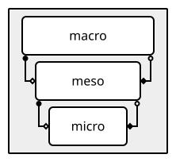
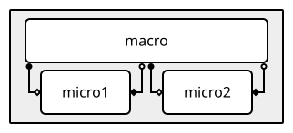
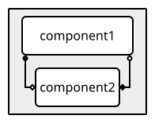
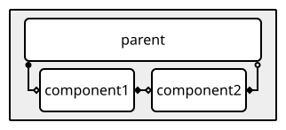
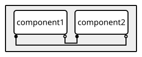
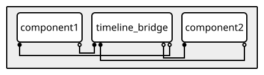
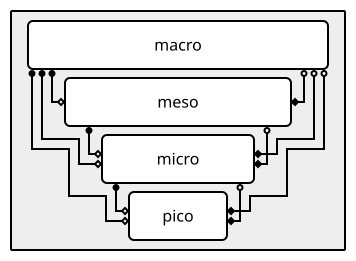
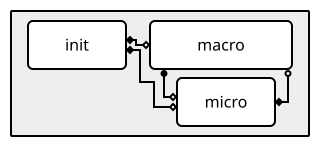

Coupling your model
===================

Multicast
---------

With MUSCLE3 you can connect an output port to multiple input ports.
When a submodel sends a message on a port that is connected to
multiple input ports, the message is copied and sent to each connected port.

.. note::

    It is not allowed to connect multiple output ports to a single input port.

Example
```````

.. tabs::

    .. code-tab:: yaml Basic macro/micro model configuration

        ymmsl_version: v0.2
        models:
          multicast:
            components:
              macro:
                description: A macro model
                implementation: macro
              micro:
                description: A micro model
                implementation: micro
            conduits:
              macro.state_out: micro.state_in
              micro.state_out: macro.state_in

    .. code-tab:: yaml Extended configuration with multicast

        ymmsl_version: v0.2
        models:
          multicast:
            components:
              macro:
                description: A macro model
                implementation: macro
              micro:
                description: A micro model
                implementation: micro
              printer:
                description: Prints messages for debugging
                implementation: printer
            conduits:
              macro.state_out: micro.state_in
              micro.state_out:
              - macro.state_in
              - printer.in

In the second tab, a new component `printer` is added and wired to the
``state_out`` port of the micro model. Whenever the micro model sends a message
on that port, one copy is sent to the macro model to continue the simulation.
Another copy is sent to the printer component, which (for example) prints a
summary of the state.

Timelines
---------

Different components of a coupled simulation typically run at their own pace:
a fast, detailed micro model may take many small steps for every single step
of the macro model driving it, while a meso model may sit somewhere in
between the two. MUSCLE3 calls this idea of "running at a different pace" a
*timeline*.

Each component has two timelines associated with it:

- Its *parent timeline* is the timeline of whatever calls it. The messages it
  receives on its ``F_INIT`` ports and sends on its ``O_F`` ports live on this
  timeline, ``<parent timeline>``. For a component that isn't called by any
  other component, the parent timeline is empty.
- Its *component timeline* is the timeline it runs on itself. Its name is the
  name of the parent timeline followed by the name of the component, joined
  with a colon, so ``<parent timeline>:<component>``. By default, the messages
  it sends on its ``O_I`` ports and receives on its ``S`` ports live on this
  timeline. If you define a timeline explicitly in your yMMSL file, those messages
  live on that named sub-timeline of the component instead. Its name is the
  component timeline followed by the name of the timeline, joined with a period, so
  ``<parent timeline>:<component>.<timeline>``. See the yMMSL documentation on
  :external+ymmsl:ref:`Timelines` for how to do this.

These two rules chain together: when a component's ``O_I``/``S`` ports are
connected to another component's ``F_INIT``/``O_F`` ports, the caller's
component timeline becomes the callee's parent timeline. If the callee in turn
has its own ``O_I``/``S`` loop, its component timeline is nested one level
deeper still, one level for every loop in the chain, a bit like a folder
structure.

Take a macro model that calls a meso model in a loop, where that meso model in
turn calls a micro model in its own loop:


         connects to micro the same way, producing three nested timelines.

The order of the boxes in the figure, from top to bottom, mirrors the nesting
in time: ``macro`` first, then ``meso`` below it, then ``micro`` below
``meso``.

Applying the two rules above gives three nested timelines:

- ``macro`` isn't called by anything, so its parent timeline is empty and its
  component timeline is ``macro``. This is where ``macro``'s ``O_I``/``S``
  messages live, and also ``meso``'s ``F_INIT``/``O_F`` messages.
- ``meso``'s parent timeline is ``macro`` and its component timeline is
  ``macro:meso``, where ``meso``'s ``O_I``/``S`` messages and ``micro``'s
  ``F_INIT``/``O_F`` messages live.
- ``micro``'s parent timeline is ``macro:meso`` and its component timeline is
  ``macro:meso:micro``.

A conduit is valid if the messages on both of its ends are on the same
timeline. The conduit from ``macro``'s ``O_I`` port to ``meso``'s ``F_INIT``
port is therefore valid, because both are on timeline ``macro``.

The named sub-timelines mentioned above come into play when a component drives
more than one loop at once, for example when it calls two other components
that run at different rates. Take ``macro`` driving ``micro1`` and ``micro2``
each in their own loop:


         micro1 and one connecting down to micro2, side by side.

``macro``'s two sub-timelines are drawn side by side beneath it, each with its
own pair of ports, one leading to ``micro1`` and the other to ``micro2``. These
two pairs of ports live on ``macro.tl1`` and ``macro.tl2``, so ``micro1`` and
``micro2`` can each run at their own pace without interfering with each other.

.. seealso::

   yMMSL documentation on :external+ymmsl:ref:`Timelines` for how to declare
   a ``timeline <name>:`` heading in a yMMSL file, and on
   :external+ymmsl:ref:`Matching timelines` for how to declare two
   timelines equivalent with ``matching_timelines``, used below for
   :ref:`Interact coupling` and :ref:`Timeline bridges`.


Send/receive order
-------------------

Placing ports on timelines like this isn't just bookkeeping: it also fixes
the order in which a component is allowed to call ``send``/``receive`` on
them. A component first receives once on each of its ``F_INIT`` ports, then works
through every ``O_I``/``S`` sub-timeline it drives. A sub-timeline doesn't
have to be used on every iteration, though: a component may skip one
entirely, going straight from ``F_INIT`` to ``O_F`` without ever sending or
receiving on it, but once it does send or receive a message on a
sub-timeline, it has to finish it: every port on that sub-timeline must have
sent or received a message before it counts as done. In the two-sub-timeline
example above, ``macro`` could, say, run its ``tl1`` loop with ``micro1``
on every iteration of its own outer loop, but only run ``tl2`` with
``micro2`` on some of them, skipping it on the rest.

Each sub-timeline fixes its own order independently of the others: whichever
action a component performs first on it, sending on ``O_I`` or receiving on
``S``, decides the order, sending on every ``O_I`` port before receiving on any
``S`` port, or the other way around, receiving on every ``S`` port before
sending on any ``O_I`` port. In the macro/meso/micro example above, every
sub-timeline happens to start with a send: ``macro`` sends on ``O_I`` before it
ever receives on ``S``, and ``meso`` and ``micro`` each do the same one level
down. The two-sub-timeline example above makes the same choice for both of
``macro``'s loops. Starting with a receive instead of a send is what a
**timeline bridge** does instead, see :ref:`Timeline bridges` below.
Only once a component is done with every sub-timeline it drives, does it send on
its ``O_F`` ports.

A component that calls send/receive out of that order, e.g. sending twice
on ``O_I`` before ``S`` has replied, or sending on ``O_F`` before every
sub-timeline has finished, gets a clear error explaining what it was
expected to do instead.


Types of coupling
------------------

MUSCLE3 distinguishes three ways in which two components can be coupled:
*call/release*, *dispatch*, and *interact*. Each one also has a direct
consequence for timelines, from sharing a single timeline to nesting one inside
the other, noted below for each.


Call/release coupling
``````````````````````

The most common pattern: Component 1's ``O_I``/``S`` ports are wired to
Component 2's ``F_INIT``/``O_F`` ports. Component 1 calls Component 2 once
per iteration, waits for its result, and continues. This is the pattern that
creates nested timelines, as described above: Component 1's component timeline
becomes Component 2's parent timeline, so Component 2's component timeline is
nested one level deeper.




Dispatch coupling 
``````````````````

Component 1's ``O_F`` port connects directly to Component 2's ``F_INIT``
port: Component 2's single run is dispatched once Component 1 finishes,
rather than being called repeatedly from inside a loop. This is how you
build a pipeline of components that each run once, in sequence.

A dispatch coupling does not add a level of nesting. The messages sent on
Component 1's ``O_F`` port are on its parent timeline, so Component 2 gets
that same parent timeline. The two components therefore end up side by side,
each with its own component timeline: if they are both called by a component
``parent``, say, they are on ``parent:component1`` and ``parent:component2``.


         component1's O_F port connects to component2's F_INIT port, and
         component2's O_F port connects back to parent's S port.
         component1 and component2 are drawn side by side below parent.


Interact coupling
``````````````````

Two components can also interact as peers: Component 1's ``O_I`` port
connects to Component 2's ``S`` port, and Component 2's ``O_I`` connects
back to Component 1's ``S``. Each component's ``O_I``/``S`` ports are on its
*own* component timeline, ``component1`` and ``component2``.

Say Component 1 and Component 2 simulate the left and right halves of the same
domain, each in its own time loop. Neither calls the other, so neither
timeline is nested inside the other: they are two separate timelines, and a
conduit between their ``O_I`` and ``S`` ports would normally be rejected. Both
halves do however step through the same time points, ``t=0, 1, 2, ...``, and on
every step each half sends its boundary to the other and receives the other's
boundary back. Each step on ``component1`` therefore lines up with exactly one
step on ``component2``: the timelines are *equivalent*, even though they are
not the same.

In that case you can declare the two timelines as matching timelines. Each
component still has its own timeline, but conduits between ports on matching
timelines are then allowed. See the yMMSL documentation on
:external+ymmsl:ref:`matching_timelines <Matching timelines>` for how to
declare matching timelines in a yMMSL file.

Matching timelines only make a conduit valid if the timelines on both of its
ends are at the same level of nesting. Connecting timelines at different levels
still requires :ref:`conduit filters <Conduit filters>`. A match also applies
only to the timelines that are declared, not to the timelines nested inside
them. Say Component 1 and Component 2 each call another component in their loop,
``sub1`` and ``sub2``, which end up on ``component1:sub1`` and
``component2:sub2``. Matching ``component1`` and ``component2`` allows conduits
between Component 1 and Component 2, but not between ``sub1`` and ``sub2``: if
those two interact as well, their timelines have to be declared as matching
too.

Matching timelines are declared per model, relative to that model. When a
nested model is connected through its model ports, MUSCLE3 matches the
timelines on either side of those ports automatically.

Both components have to send on their ``O_I`` port before either receives on
``S``. If both components take steps at exactly the same pace, this works in
lock-step, every send on one side is matched by a receive on the other, one
message at a time:


         component2's O_I port connects back to component1's S port.


Timeline bridges
````````````````

If Component 1 and Component 2 from the :ref:`Interact coupling` above don't
take equal-sized steps, wiring them together directly no longer works: whichever
one takes the smaller steps would have to wait for a message the other isn't ready
to send yet, so the two end up waiting on each other, which can hang or deadlock
the run entirely. What's needed instead is a component that sits between them and
transforms each incoming message to the timestep the other side expects.
A **timeline bridge** does exactly that. The different ways in which a bridge
can convert messages between the two timelines are described in
:doc:`timeline_bridges`.

The bridge has an ``O_I``/``S`` port pair for each side, each on a separate
sub-timeline: ``timeline_bridge.component1``, on which it follows the time
points of Component 1, and ``timeline_bridge.component2``, on which it follows
those of Component 2. These sub-timelines are the bridge's own, not Component
1's or Component 2's, so just like in the interact coupling, the conduits
between the bridge and its peers are only valid once each of the bridge's
sub-timelines is declared as matching the timeline of the component on that
side. This is what that looks like in a yMMSL:

.. code-block:: yaml
    :caption: yMMSL for a timeline bridge connecting ``component1`` and ``component2``

    components:
      component1:
        ports:
          o_i: boundary_out
          s: boundary_in
        implementation: model
      component2:
        ports:
          o_i: boundary_out
          s: boundary_in
        implementation: model
      timeline_bridge:
        ports:
          timeline component1:
            o_i: a_out
            s: a_in
          timeline component2:
            o_i: b_out
            s: b_in
        implementation: temporal_coupler
    matching_timelines:
      component1: timeline_bridge.component1
      component2: timeline_bridge.component2
    conduits:
      component1.boundary_out: timeline_bridge.a_in
      component2.boundary_out: timeline_bridge.b_in
      timeline_bridge.a_out: component1.boundary_in
      timeline_bridge.b_out: component2.boundary_in


         component1's O_I/S ports to timeline_bridge's
         a_out/a_in, and component2's O_I/S ports to its b_out/b_in.

Its general job is to keep passing values between the two sides despite
them never actually running in step: say Component 1 steps in increments
of 5 (``t=0, 5, 10, ...``) while Component 2 steps in increments of 13
(``t=0, 13, 26, ...``). When Component 1 asks for a value at ``t=5``,
Component 2 has only produced a message for ``t=0`` so far, with its next
one not due until ``t=13``, so the bridge has to determine a sensible
value for ``t=5`` itself. ``docs/source/examples/python/interact_coupling.py``
in the MUSCLE3 source contains a complete, runnable example of exactly
this component (``temporal_coupler``): its ``DataCache`` keeps the last
two messages it received from a peer and interpolates between them, so
once it has Component 2's messages for ``t=0`` and ``t=13``, it can answer
Component 1's request for ``t=5`` by interpolating between the two.

As covered in :ref:`Send/receive order`, whichever action happens first on a
sub-timeline decides its order for the rest of the run. Before it has received
anything at all, though, the bridge has no messages to interpolate
between and so nothing sensible to send, unlike most other couplings,
which send first a bridge has to receive on ``S``
before it ever sends on ``O_I``, on each of its sub-timelines. The
``Peer`` class in ``interact_coupling.py`` does exactly this in its
constructor, receiving an initial message before its main loop ever calls
``send``.


Conduit filters
----------------

An ordinary conduit connects two ports whose messages live on the same
timeline. A conduit filter lets you connect ports on different, nested
timelines directly, without relaying the messages through the components in
between.

Take the macro-meso-micro example from `Timelines`_, extended with a fourth
level, ``pico``, which is called by ``micro``. Besides the ordinary conduits
between each component and the one it calls, ``macro`` also has conduits
directly to ``micro`` and to ``pico``:


         of conduits connect macro directly to micro, bypassing meso, and macro
         directly to pico, bypassing meso and micro.

``macro``'s ``O_I``/``S`` messages live on ``macro``, while ``micro``'s
``F_INIT``/``O_F`` messages live on ``macro:meso``, one level deeper. ``micro``
is called many times for every step of ``macro``, so the conduit from ``macro``
to ``micro`` has to turn one message into many, and the conduit back has to
turn many messages into one. Without filters, ``meso`` would have to do this
with extra ports and relay code. With filters, the conduit does it, and
``meso`` doesn't need to know about these messages at all.

There are three filters:

- ``repeat`` goes from the shallower timeline to the deeper one. It resends the
  single message from the shallower side unchanged on every receive on the
  deeper side, until a new message replaces it.
- ``pad`` also goes from the shallower timeline to the deeper one. It passes
  the message through once, and follows it with empty messages for the
  remaining receives on the deeper side.
- ``last`` goes from the deeper timeline to the shallower one. Only the most
  recently sent message is delivered; the rest are dropped. If nothing was sent
  on the deeper side at all, for example because the loop in between was
  skipped, the shallower side receives an empty message instead.

Each filter bridges exactly one level of nesting, so the conduits between
``macro`` and ``micro`` need a single ``repeat`` and ``last``. The conduits
between ``macro`` and ``pico`` skip two levels, so they need two filters each.
On the way down, ``repeat repeat`` repeats ``macro``'s message for every call
of ``micro``, and then again for every call of ``pico``. On the way back up,
``last last`` reduces ``pico``'s messages to the last one per call of
``micro``, and then those to the last one per step of ``macro``. With the wrong
number of filters, the timelines on the two ends don't match and the yMMSL
configuration is rejected.

Filters can also be combined with
:external+ymmsl:ref:`matching timelines <Matching timelines>`, which are taken
into account after the filters have been applied. See the yMMSL documentation
on :external+ymmsl:ref:`Conduit filters` for how to declare ``repeat``,
``pad`` and ``last`` filters in a yMMSL file.


Example: sending initial data to a nested component
````````````````````````````````````````````````````

A common use of conduit filters is a component that prepares the input for a
simulation once, at the start. Here, ``init`` creates the initial state and
dispatches it to ``macro``, which then calls ``micro`` in its loop. ``micro``
also needs some data from ``init``, for example a description of the machine
that doesn't change during the run, so ``init`` sends that to ``micro``
directly, instead of via ``macro``:


         of micro's F_INIT ports. macro's O_I/S ports connect to micro's other
         F_INIT port and its O_F port.

.. code-block:: yaml
    :caption: yMMSL for ``init`` sending data directly to ``micro``

    ymmsl_version: v0.2

    models:
      init_macro_micro:
        components:
          init:
            ports:
              o_f: macro_out micro_out
            description: Creates the initial state and the static input data
          macro:
            ports:
              f_init: init_in
              o_i: bc_out
              s: bc_in
            description: Macro model
          micro:
            ports:
              f_init: init_in static_in
              o_f: final_out
            description: Micro model
        conduits:
          init.macro_out: macro.init_in
          init.micro_out: repeat micro.static_in
          macro.bc_out: micro.init_in
          micro.final_out: macro.bc_in

``init`` isn't called by anything, so its ``O_F`` messages live on the empty
parent timeline. ``micro``'s ``F_INIT`` messages live on ``macro``, one level
deeper, so the conduit from ``init`` to ``micro`` needs a single filter:

- ``repeat`` if ``micro`` needs the data on every call, so that it receives the
  same message each time. Note that ``micro`` must receive on its
  ``static_in`` port on every call, even if the message is always the same or
  empty, to keep the models synchronised.
- ``pad`` if ``micro`` only needs it on its first call, for example because it
  keeps the data itself. On every later call, ``micro`` then receives an empty
  message on that port.

If ``macro`` calls a ``meso`` model that in turn calls ``micro``, ``micro``'s
``F_INIT`` messages live on ``macro:meso``, two levels deeper, and the conduit
needs two filters, for example ``repeat repeat``.
