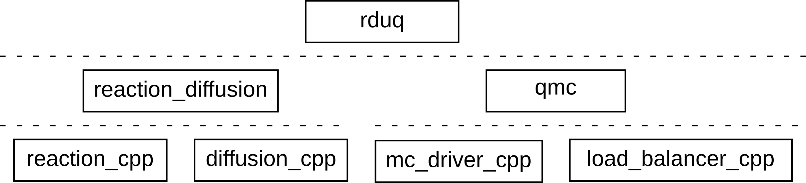
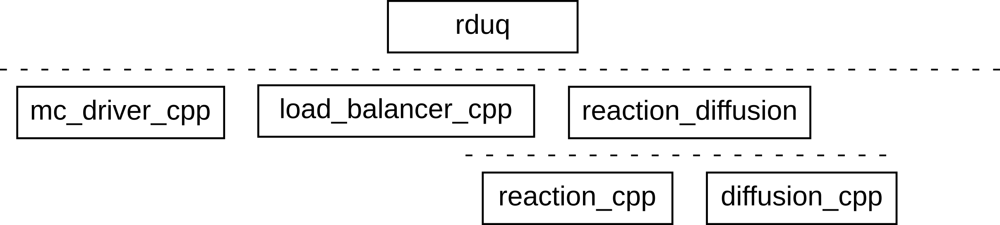
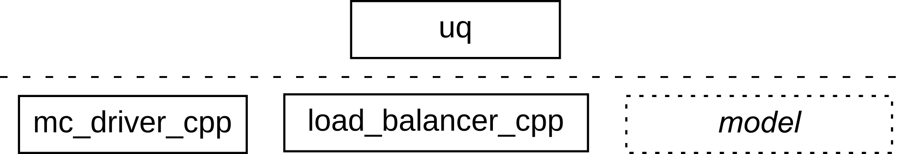

Models as software
==================

Besides being a description of some physical system, simulation models are also
software. Small models are often made by a single researcher/developer, and don't need
much structure to remain manageable. Larger and more complex models tend to stretch
beyond the expertise and resources of a single researcher however, and need to be
developed collaboratively over a longer period of time. Besides good scientific
practice, good software engineering practice is then also needed.

A search for research software engineering best practices will find you many resources
on things like using version control, testing, documentation, and so on, and so we will
not go into these aspects here. (You should definitely have a look though, and apply
these techniques!)

Instead, we'll look at two aspects specific to development of MUSCLE3 models:
architecture and collaborative development.

Model architecture
------------------

Since simulation models are both descriptions of the real world and also computer
programs, they have two kinds of architecture. There's the conceptual architecture,
which is about which domains the modelled system consists of, which processes take place
there, interactions between them, spatial and temporal scales, and so on. And there's
the software architecture, which is about how the source code implementing the model is
organised.

Both of these are important for good computational science. They're separate problems,
but because the software does need to implement the concepts, they're interrelated.
Often it's useful to arrange the software to follow the model structure, but deviations
may also make sense, such as when two conceptually unrelated parts of the model can
share some generic code.

Unfortunately, there's no set of simple rules for good software design. Experience
really helps, but experienced software developers are somewhat scarce in (computational)
science. So you may just have to do your best, and hopefully the guidelines below can be
of help.

If you do discover that a design decision you made wasn't the best, don't be afraid to
try something else, and remember that this is exactly how those experienced software
developers got their experience. With every mistake you find and fix, your software will
be designed a little bit better, and its developer will be a bit better at software
design.

Small models
''''''''''''

For small MUSCLE3 models that you run yourself, you can put everything you need into a
single yMMSL file, including the model, settings, programs and resources. As shown by
the tutorial though, it's often useful to split this information across multiple yMMSL
files.

This will let you easily compare two different model configuration using different
settings files for different runs, or you could sometimes add a file with custom
implementations if you want to validate one code against another. If you use different
computers and/or have different configurations that vary widely in how expensive they
are to run, then you may want separate resource files as well so that you can easily
give the big runs more resources.

In general, keeping things separate gives you more flexibility, and it allows you to
have multiple configurations side-by-side, which is much better for reproducibility than
a single constantly evolving configuration.

Layered architecture
''''''''''''''''''''

For larger models, you'll want to create a :ref:`hierarchical model <Nested models>`,
in which some of the components are implemented by submodels, which in turn may contain
more programs and submodels. Different developers can then work on different submodels,
and as long as they agree on the interfaces between them they won't break each other's
code.

Of course, this means that the model needs to be organised somehow into smaller pieces.
A good way to do this is to use a layered architecture. The example from the
:ref:`Importing implementations` section has such a layered architecture.

   Layered architecture of the nested UQ model

At the bottom, there are the ``diffusion_cpp`` and ``reaction_cpp`` programs, which each
implement a physical process. One layer up, there's the ``reaction_diffusion`` model
that couples them together, and then the top layer is formed by the ``rduq`` model,
which also relies on the ``qmc`` model from the middle layer, which in turns sits on
top of the ``mc_driver_cpp`` and ``load_balancer_cpp`` programs in the bottom layer.

Are there other ways that this model could be organised? Yes. If we look at the
conceptual structure of the model, then we see that we have an ensemble of model runs.
Inside of each run, there's a slow diffusion process, at each timestep of which we run a
much faster reaction simulation. This is a kind of hierarchy too, but it does not align
with the way the software is arranged. There, we have UQ and reaction-diffusion sitting
side-by-side in the middle layer, rather than reaction-diffusion sitting inside of (or
below) the UQ part.

The latter would actually have been quite a natural thing to do. Imagine that we have
the ``reaction_diffusion`` model, and that we now want to do an uncertainty
quantification of it. Most researchers in this case would make an ``rduq`` model
containing the ``mc`` (sampler) component and the ``rr`` (load balancer) component,
connected to a third ``model`` component which is implemented by ``reaction_diffusion``.
This creates an architecture like this:

   Alternative layered architecture of the nested UQ model

Note that now the two hierarchies are aligned, with the reaction-diffusion model sitting
below or inside the uncertainty quantification model.

(There is no yMMSL implementation available for this, but if you want, go ahead and try
to create it. It's a nice exercise!)

Is this better? It's more natural to align the hierarchies like this, but there's a
disadvantage: the Monte Carlo sampling part of this model isn't very reusable. It's
hard-coded to use the ``reaction_diffusion`` model, and you have to modify the code if
you want to do something else with it.

The first implementation does not have this issue. Both the reaction-diffusion and uq
parts of the model are components that are used by ``rduq`` in the top layer. If you
wanted to use the Monte Carlo sampler with a different model, then you could make a
different top layer that combines ``qmc`` with that.

Even better, you could have both top-level models in different files side-by-side, with
both of them using ``qmc`` but each using a different model. Of course, you could
copy-paste the top-level model of the aligned-hierarchies version too, and modify the
copy to use the other simulation submodel.

However, if you then found a bug in the Monte Carlo part, then you'd have to remember to
update both copies (or however many you end up having...). In the first implementation,
there's only one copy to update so that everything is always up-to-date.

This is a nice example of how software architecture typically requires some experience.
If you look at existing codes in computational science, you'll find that the latter
architecture is very common, and that copy-pasting and modifying is the normal way of
working. There's usually a better option though, and it pays to try to find it.

Frameworks
''''''''''

There's another fairly common way to design reusable software, and that is the
framework. Where in a layered architecture we create reusable components that we can
reuse by building things on top of them, a framework does the opposite: it specifies a
reusable top layer that users then attach things to from the bottom.

As always, this has advantages and drawbacks. An advantage is that it's usually easier
to create a top layer than to make a reusable block for others to build things on top
of, because if you make the top layer then you're the one deciding all the concepts and
how things work and everyone using your framework has to adapt to that. Making a
reusable component for others to build on top of is more difficult, because it will have
to be flexible enough to fit with whatever it is that they're doing.

MUSCLE3 itself is actually an example of this. Unlike many other model coupling systems,
when you connect your code to MUSCLE3 you do so through a library, which results in
minimal disruption to the code structure. In contrast, there are coupling systems which
require you to convert the code to a library implementing a particular API, which the
coupling system and often a driver script then sit on top of. Such a framework is easier
to code for the creator of the coupling system, but more work for the modeller. So this
advantage is actually also a disadvantage.

Another disadvantage of frameworks is that they're not composable. While you can and
almost always will put your program or script on top of a layer containing multiple
libraries, you can't plug your code into multiple frameworks at the same time.

Does that mean that frameworks are generally a bad idea? Not necessarily. There are
cases where most of the structure of an application will always be fixed, with only some
flexible parts. In that case, it may make sense to build a framework, essentially a
complete application with some customisation points.

How does this work in MUSCLE3? Above, we proposed an alternative architecture for the
reaction-diffusion UQ example in which there is a top-level model containing the sampler
and the load balancer, as well as a ``model`` component implemented by
``reaction_diffusion``. If we take that, but remove the implementation from ``model``,
then we have a framework for uncertainty quantification:

   A framework for uncertainty quantification

A user would then use the framework like this:

.. code-block:: yaml

   ymmsl_version: 0.2

   imports:
   - from uq_framework import implementation uq
   - from reaction_diffusion import implementation reaction_diffusion

   custom_implementations:
     uq.model: reaction_diffusion

Here, we import the framework, and then the model, and then we use the
``custom_implementations`` feature to plug the model into the framework. The file would
then contain some settings and resources as well to configure things (not shown).

.. rubric:: Optional components

Above, we have a framework that has an extension point that has to be filled in by the
user. Often when making a framework you'll want to make those points optional. With
MUSCLE3, there are two ways of doing this.

The first is to make an optionally-implemented component, by ensuring that everything
connected to it can deal with the ports leading to and from the optional component not
being connected.

For ports sending to the optional component this is always the case, as sends on ports
that are not connected to anything are valid and will do nothing. For ports receiving
from the optional component, a default message must be given in the receive call. We've
actually already seen this in the diffusion model, which can run without a reaction
model attached.

With the above set up, the optional component can then be added to the model, and
connected to the other components it needs to communicate with if present. You can
specify an implementation, if you want the optional component to have a default
implementation, or you can leave out the implementation if you want it to be absent by
default.

Users can use ``custom_implementations`` to set a different implementation if they want,
and they can even unset the implementation using

.. code-block:: yaml

   custom_implementations:
     optional_component:

This looks a bit odd, not specifying a value at all, but it's how you write ``None`` in
YAML, and this syntax will override any default implementation and leave the component
with no implementation at all.

MUSCLE3 will automatically remove components without an implementation, as well as any
conduits attached to them, so you'll end up with either a component with the desired
implementation, or no component at all.

Sometimes having the component missing entirely isn't what you want, for example if you
want to have an optional component on a conduit in between two non-optional ones. In
that case, you want to either have the component in there, with e.g. an implementation
that modifies the data being sent, or you want to have the sender and the receiver
connected directly to each other.

In this case, rather than removing the component entirely if it's not needed, you can
use a default implementation that simply passes the data unchanged. This is easy to
implement using an empty model:

.. code-block:: yaml

   models:
     passthrough:
       ports:
         f_init: in
         o_f: out
       conduits:
         in: out

If you set this as the default implementation of a component in between the sender and
the receiver, then they'll be connected directly by default. However, if a
``custom_implementation`` changes the implementation to a program that does something to
the data, then that will end up in between and the transformation is applied.

Collaborative development
-------------------------

When developing larger models with multiple people, the issue arises of how to exchange
model code, both MUSCLE3-enabled programs and models coupling them together. If you're
all in the same project, then one option is to put everything into a single version
control repository. Often however, the programs will already have their own
repositories, and maybe you're reusing a model shared by someone else without working
together closely. In that case, we need a different solution.

Of course, this situation is not specific to MUSCLE3 or to making simulation models. It
arises anywhere software is developed: to share your code, you need to package and
distribute it.

MUSCLE3 doesn't have a built-in packaging system and repository like Python and other
modern languages do. Simulation models are often written in C++ or Fortran, which don't
have one either. Such codes are usually distributed as source code, or sometimes using a
generic packaging or installation system like conda or, on HPC, environment modules.

Regardless of how you package, distribute, and install MUSCLE3 model components, they
need to be made available to MUSCLE3. To do that, there need to be one or more yMMSL
files with program or model descriptions, and they need to be in a place where MUSCLE3
can find them. If you're distributing a Python package, you can also declare an Entry
Point, this is described in: :ref:`Python package Entry Points`

In general, you can do that as follows. First, make a ``ymmsl/`` directory somewhere in
the source directory for your yMMSL files to go into. You may want to make a
subdirectory in it named after your code or model, especially if you have multiple ymmsl
files for the user to import from. If there's only one thing to import, then putting a
single file directly into the ``ymmsl/`` directory works fine.

.. caution::

  If your model or code has a somewhat generic name that is also used for other things,
  then it's probably a good idea to put it inside of a subdirectory that disambiguates
  things and avoids name clashes. You could use ``ymmsl/my_organisation/`` for example,
  or ``ymmsl/branch_of_science/``, or you could even follow the example set by the Java
  programming language and use the internet domain of your organisation in reverse, like
  ``ymmsl/nl/esciencecenter/``. Users can then import ``my_organisation.my_program`` for
  example, and avoid confusion with another program with the same name.

If you're distributing a code, then the yMMSL file containing the program definition
will probably have to be made from a template, because it will have to refer to wherever
the executable ends up getting installed. Ideally, your build system will do this
automatically at compile time, or if you're using a packaging system like conda then the
location needs to be adjusted at install time. There's usually a way to achieve that, so
have a look at the documentation for whatever you're using.

With this in place, the next step is to install the ``ymmsl/`` directory along with the
rest of the software, and then to add its location to ``YMMSL_PATH``. If the user is
installing from source, then they'll have to do that themself, and you should tell them
that in the documentation.

Conda can source a script whenever a package is installed or an environment is
activated, through which you can set environment variables, and for example EasyBuild
also has a facility for setting environment variables. If you're using a packaging
mechanism that has this available, then you can set ``YMMSL_PATH`` automatically for the
user whenever they activate the package.

The final thing to do then is to document how the user should import your program or
model, and how to use it, and then they should be good to go.

.. _`Python package Entry Points`:

Python package Entry Points
'''''''''''''''''''''''''''

.. important:: This functionality requires the 0.15.1 release of ymmsl-python.

.. seealso:: `Corresponding ymmsl-python documentation <https://ymmsl-python.readthedocs.io/en/stable/describing_models.html#python-entrypoints>`__

When distributing a model as a Python package, you can use Python's plugin mechanism
(Entry Points) to make your model importable for users. You will need to:

1. Configure the entry point in your ``pyproject.toml`` (or ``setup.py``) file.
2. Provide the yMMSL configuration as a string inside your python distribution.

Below code listings provide an example how to do this.

.. code-block:: toml
    :caption: Entry point configuration in ``pyproject.toml``

    # Indicate you want to provide an entry point for "ymmsl.path":
    [project.entry-points."ymmsl.path"]
    # Provide one or more "name = value" entries, pointing to a valid yMMSL
    # configuration string (see next code listing). For more details, see
    # https://setuptools.pypa.io/en/latest/userguide/entry_point.html#entry-points-syntax
    "example.model" = "my_package.example_model:YMMSL_CONFIG"

.. code-block:: python
    :caption: yMMSL configuration string in ``my_package/example_model.py``

    import sys

    YMMSL_CONFIG = f"""
    ymmsl_version: v0.2
    description: Example model
    programs:
      example:
        description: |
          Example component that can be imported with
          `- from example.model import implementation example`
        executable: {sys.executable}
        args: -m my_package.example_model
        ports:
          f_init: example_input
          o_f: example_output
    """

