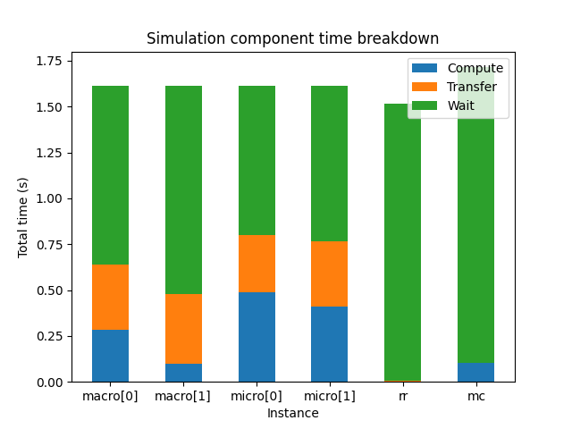
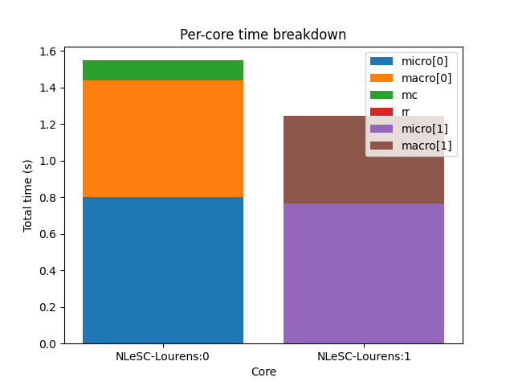
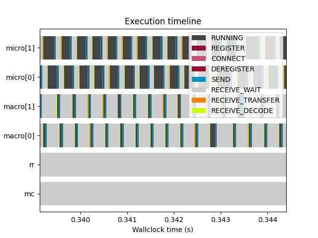

Profiling coupled simulations
=============================

The first challenge one faces when creating a coupled simulation is getting it
to run correctly. Once the model is running and producing results however, the
question often becomes how to make it run faster, so as to be able to do science
more efficiently. The model needs to be optimised.

The first step of optimisation is measurement: how much compute time does the
model spend on what? Without measurement, you end up optimising parts that don't
contribute significantly to the total run time, thus making little progress.

Measuring and optimising individual submodels is outside of the scope of
MUSCLE3. This should be done at the level of the individual model, using
profilers like gprof or perf or TotalView, and there isn't much MUSCLE3 can
contribute. In a coupled simulation however, you first need to know which of
the coupled models takes the most compute time and should therefore be
optimised, and this MUSCLE3 can help with.

A MUSCLE3 simulation consists of a set of submodels, which during the simulation
spend some of their time computing, some of it waiting for inputs to arrive from
other submodels, and some of it transferring data. The communication activities
are done through ``libmuscle``, and computing (and internal communication, if
the model is parallelised) takes place in between them. During each run,
``libmuscle`` will measure when each external communication takes place, how
much time was spent waiting, and how much time was spent transferring the data.
This information is collected centrally and saved to a file, which you can then
analyse to discover where the coupled simulation can best be optimised.

Configuring profiling
---------------------

Profiling is enabled by default, so you do not have to do anything to get
MUSCLE3 to produce profiling data. For typical coupled simulations consisting of
only a few instances that do not communicate very often, this should not affect
the simulation performance. If you have a simulation with very many instances
which communicate intensively, then the overhead of sending all that information
to the central database can become significant.

If that is the case, then you should do your profiling with a smaller number of
instances, and disable profiling for the large run to avoid the overhead.
Profiling can be disabled by setting the setting ``muscle_profile_level`` to
``none`` in the yMMSL file. To enable profiling, set it to ``all``, or don't set
it at all. Just like for other settings, this can be set per-instance as well,
to selectively collect profiling information from part of the simulation.


The profiling database
----------------------

After a MUSCLE3 simulation is done, you will find a file called
``performance.sqlite`` in the run directory, next to the main log file. This
file is a database containing several tables with performance information about
the run.

This information can be analysed in three ways: 1) through the ``muscle3
profile`` command, 2) via the :class:`libmuscle.ProfileDatabase` class in
Python, and 3) directly via ``sqlite3`` from the shell or from Python. All three
are described here.


Plotting statistics from the command line
-----------------------------------------

The simplest way of examining performance data gathered by MUSCLE3 is through
the ``muscle3 profile`` command from the shell. If you have done a run, then
you should have a run directory containing a ``performance.sqlite`` file.  If
you have MUSCLE3 available in your environment (only the Python installation is
needed) then you have the ``muscle3 profile`` command available to show
per-instance and per-core statistics as well as a timeline of events.

Per-instance time spent
```````````````````````



.. code-block:: bash

    muscle3 profile --instances /path/to/performance.sqlite

With ``--instances`` or ``-i``, the plot will show for each instance how much
time it spent in total on computing, communicating and waiting. This plot gives
an idea of where most of the computing is done, and which components you need
to optimise to get an answer sooner.

In many models, you will find that there's one component that takes up most of
the compute time, and others that spend most of their time waiting and then do a
little bit of computing. This is not necessarily wasteful, it may simply be that
most of the work is in that one component. Of course it does mean that if you
want to get your result faster, you should focus your efforts on the component
that takes the most time.

This works fine for relatively simple models, but there are some caveats to take
into account. First, model components may use different amounts of resources. A
component that runs 10% of the time, but uses 100 cores, uses a lot more energy
than one that runs 90% of the time on a single core. On the other hand, if you
are interested in getting an answer more quickly, then you should optimise the
single-core model first.

If you are running on HPC, then you most likely have a fixed budget of
core hours or system billing units (SBUs), and reducing SBU usage may be of
interest. In the above scenario, both models are actually candidates for
optimisation in this case. If you can speed up the parallel model so that it can
run as fast on fewer cores then that potentially saves many SBUs. But speeding
up the single-thread model also helps, because even if the cores that the
parallel model runs on aren't used, they're still allocated and you're still
paying for them.

If all your models spend most of their time communicating, then your models do
relatively little work in between sending and receiving messages. In that case,
either MUSCLE3 needs to be optimised, or perhaps your coupling is simply too
tight to do over a network connection and you should consider integrating the
codes directly.

Resource usage
``````````````



.. code-block:: bash

    muscle3 profile --resources /path/to/performance.sqlite

If you are running on a large computer, then it may be interesting to see how
you are using the resources allocated to you. The command ``muscle3 profile
--resources performance.sqlite`` will produce a plot showing for each core how
much time it spent running the various instances (``-r`` for short also works).
This gives an idea of which component used the most resources, and tells you
what you should optimise if you're trying to reduce the number of core hours
spent.

The total time shown per core doesn't necessarily match the total run time, as
cores may be idle during the simulation. This can happen for example if
components A and B alternate execution but use different numbers of cores.
MUSCLE3 will automatically detect that A and B alternate and assign overlapping
sets of cores so as to use them optimally, but if A uses 10 and B uses 15 cores,
then inevitably 5 cores will be idle while A is running.

Event timeline
``````````````



.. code-block:: bash

    muscle3 profile --timeline /path/to/performance.sqlite

If you really want to get into the details, ``--timeline`` or ``-t`` shows a
timeline of profiling events. This visualises the raw data from the database,
showing exactly when each instance sent and received data, when it was waiting
for input, and when it computed. The meaning of the event types shown is as
follows:

REGISTER
    The instance contacted the manager to share its location on the network, so
    that other instances can communicate with it.

CONNECT
    The instance asked the manager who to communicate with, and set up
    connections to these other instances.

RUNNING
    The instance was running, meaning that it was actively computing or doing
    non-MUSCLE3 communication.

SHUTDOWN_WAIT
    The instance was waiting to receive the information it needed to determine
    that it should shut down, rather than run the reuse loop again.

DISCONNECT_WAIT
    The instance was waiting for the instances it communicates with to
    acknowledge that it would be shutting down. This may take a while if those
    other instances are busy doing calculations or talking to someone else.

SHUTDOWN
    The instance was shutting down its MUSCLE3 communications.

DEREGISTER
    The instance contacted the manager to say that it was ending it run.

SEND
    The instance was sending a message. This includes encoding the sent data and
    putting it in a queue, ready to be picked up by the receiver. The actual
    transfer is done in the background, and is excluded here.

RECEIVE_WAIT
    The instance was waiting for another instance to send it a message.

RECEIVE_TRANSFER
    The instance was receiving data from another instance. Note that because of
    the way operating systems work, transfer of the very first bit of data (the
    first network packet) is counted with RECEIVE_WAIT, so that for very small
    messages this may seem to take no time at all.

RECEIVE_DECODE
    The received data were being decoded and turned into Python objects or Data
    objects.

On most installations, this plot is interactive, so be sure to use the pan and
zoom buttons at the bottom of the window to explore the data.

The plots here are implemented using ``matplotlib``, which doesn't do very well
displaying large numbers of events. To avoid endless rendering, the data will be
truncated if it is too large, so that you can at least see the start of the
simulation. If you find yourself running into this limitation, please make an
issue on GitHub and we'll increase the priority on improving this.


Analysis with Python
--------------------

If you want to get quantitative data, or just want to make your own plots, then
you can use MUSCLE3's Python API. It contains several useful functions for
extracting information and statistics from a profiling database. They are
collected in the :py:class:`libmuscle.ProfileDatabase` class.

Per-instance statistics
```````````````````````

The first of these functions produces per-instance statistics, and is used like
this:

.. code-block:: python

    from libmuscle import ProfileDatabase

    with ProfileDatabase('performance.sqlite') as db:
        instances, compute, transfer, wait = db.instance_stats()


This will give you four lists with corresponding entries. ``instances`` contains
strings with the names of the instances in the simulation. ``compute`` contains
numbers of seconds the instance spent computing for each instance. ``transfer``
is the total time spent transferring data, and ``wait`` contains the total time
spent waiting for a message.

As an example, here's how to create a plot similar to the one ``muscle3
profile`` produces using this data:

.. code-block:: python

    import numpy as np
    import matplotlib.pyplot as plt

    fig, ax = plt.subplots()

    width = 0.5
    bottom = np.zeros(len(instances))
    ax.bar(instances, compute, width, label='Compute', bottom=bottom)
    bottom += compute
    ax.bar(instances, transfer, width, label='Transfer', bottom=bottom)
    bottom += transfer
    ax.bar(instances, wait, width, label='Wait', bottom=bottom)
    ax.set_title('Simulation component time breakdown')
    ax.set_xlabel('Instance')
    ax.set_ylabel('Total time (s)')
    ax.legend(loc='upper right')
    plt.show()


Per-core statistics
```````````````````

For optimising resource usage, per-core statistics give some useful insight.
They can be obtained from :py:class:`libmuscle.ProfileDatabase` as well:

.. code-block:: python

    from libmuscle import ProfileDatabase

    with ProfileDatabase('performance.sqlite') as db:
        stats = db.resource_stats()


This returns a dictionary which for each core contains an inner dictionary that
contains the total runtime of each component using that core. Thus, to find out
how much time core ``c`` spent running component ``m``, you get ``stats[c][m]``.

A per-core plot of ``stats`` as shown by ``muscle3 profile`` can be made as
follows:

.. code-block:: python

    import matplotlib.pyplot as plt

    fig, ax = plt.subplots()

    for i, core in enumerate(sorted(stats.keys())):
        bottom = 0
        for instance, time in sorted(stats[core].items(), key=lambda x: -x[1]):
            ax.bar(
                    i, time, 0.8,
                    label=instance, bottom=bottom)
            bottom += time

    ax.set_xticks(range(len(stats)))
    ax.set_xticklabels(stats.keys())

    ax.set_title('Per-core time breakdown')
    ax.set_xlabel('Core')
    ax.set_ylabel('Total time (s)')
    ax.legend(loc='lower right')

    plt.show()


Analysing events
````````````````

Finally, :py:class:`libmuscle.ProfileDatabase` has a function for analysing
events in more detail: :py:func:`libmuscle.ProfileDatabase.time_taken`.

This function returns the mean or total time spent on or between selected points
in time recorded in the database, in nanoseconds. Note that due to operating
system limitations, actual precision for individual measurements is limited to
about a microsecond.

For profiling purposes, an event is an operation performed by one of the
instances in the simulation. It has a type, a start time, and a stop time. For
example, when an instance sends a message, this is recorded as an event of type
SEND, with associated timestamps. For some events, other information may also be
recorded, such as the port and slot a message was sent or received on, message
size, and so on.

:py:func:`libmuscle.ProfileDatabase.time_taken` takes two points in time, each
of which is the beginning or the end of a certain kind of event, and calculates
the time in nanoseconds between those two points. For example, to calculate how
long it takes instance ``micro`` to send a message on port ``final_state``, you
can do

.. code-block:: python

    >>> with ProfileDatabase('performance.sqlite') as db:
    ...     db.time_taken(
    ...             etype='SEND', instance='micro', port='final_state')
    ...
    9157.706

This selects events of type ``SEND``, as well as an instance and a port, and
since we didn't specify anything else, we get the time taken from the beginning
to the end of the selected event. The ``micro`` model is likely to have sent
many messages, and this function will automatically calculate the mean duration.
So this tells us on average how long it takes ``micro`` to send a message on
``final_state``.

Averaging will be done over all attributes that are not specified, so for
example if ``final_state`` is a vector port, then the average will be taken over
all sends on all slots, unless a specific slot is specified by a ``slot``
argument.

It is also possible to calculate time between different events.  For example, if
we know that ``micro`` receives on ``initial_state``, does some calculations,
and then sends on ``state_out``, and we want to know how long the calculations
take, then we can use

.. code-block:: python

    >>> with ProfileDatabase('performance.sqlite') as db:
    ...     db.time_taken(
    ...             instance='micro', port='initial_state',
    ...             etype='RECEIVE', time='stop',
    ...             port2='final_state', etype2='SEND',
    ...             time2='start')
    ...
    672832.666


This gives the time between the end of a receive on ``initial_state`` and the
start of a subsequent send on ``final_state``. The arguments with a 2 at the end
of their name refer to the end of the period we're measuring, and by default
their value is taken from the corresponding start argument. So, the first
command above is actually equivalent to

.. code-block:: python

    db.time_taken(
        etype='SEND', instance='micro', port='final_state',
        slot=None, time='start', etype2='SEND',
        port2='final_state', slot2=None, time2='stop')

which says that we measure the time from the start of each send by ``micro`` on
``final_state`` to the end of each send on ``final_state``, aggregating over all
slots if applicable.

Speaking of aggregation, there is a final argument ``aggregate`` which defaults
to ``mean``, but can be set to ``sum`` to calculate the sum instead. For
example:

.. code-block:: python

    >>> with ProfileDatabase('performance.sqlite') as db:
    ...     db.time_taken(
    ...             etype='RECEIVE_WAIT', instance='macro',
    ...             port='state_in', aggregate='sum')
    ...
    463591064


gives the total time that ``macro`` has spent waiting for a message to arrive on
its ``state_in`` port.

If you are taking points in time from different events (e.g.  different
instances, ports, slots or types) then there must be the same number of events
in the database for the start and end event. So starting at the end of
``REGISTER`` and stopping at the beginning of a ``SEND`` on an ``O_I`` port will
likely not work, because the instance only registers once and probably sends
more than once.


SQL data model
--------------

If you want to inspect the data in even more detail, then you can access the
database directly through the ``sqlite3`` command line tool or the ``sqlite3``
Python package. A full SQL tutorial is outside the scope of this documentation,
but the data model is documented here.

Database format version
```````````````````````

+------------------------------------+
|          muscle3_format            |
+================+===================+
| major_version  |  INTEGER NOT NULL |
+----------------+-------------------+
| minor_version  |  INTEGER NOT NULL |
+----------------+-------------------+

This table stores a single row containing the version of the database format
used in this file. This uses semantic versioning, so incompatible future formats
will have a higher major version. Compatible changes, including addition of
columns to existing tables, will increment the minor version number. Note that
this means that ``SELECT * FROM ...`` may give a different result for different
minor versions. To make your code compatible with future minor versions, it's a
good idea to specify the columns you want explicitly.

Here is a brief version history:

Version 1.0
    Initial release.

Version 1.1
    Added new ``SHUTDOWN_WAIT``, ``DISCONNECT_WAIT`` and ``SHUTDOWN`` events.
    No changes to the tables.

Formatted events
````````````````

+--------------------------------------+
|              all_events              +
+===================+==================+
| instance          | TEXT             |
+-------------------+------------------+
| type              | TEXT             |
+-------------------+------------------+
| start_time        | INTEGER NOT NULL |
+-------------------+------------------+
| stop_time         | INTEGER NOT NULL |
+-------------------+------------------+
| port              | TEXT             |
+-------------------+------------------+
| operator          | TEXT             |
+-------------------+------------------+
| port_length       | INTEGER          |
+-------------------+------------------+
| slot              | INTEGER          |
+-------------------+------------------+
| message_number    | INTEGER          |
+-------------------+------------------+
| message_size      | INTEGER          |
+-------------------+------------------+
| message_timestamp | DOUBLE           |
+-------------------+------------------+

This is actually a view that presents data from other tables in a friendlier
format.

Instances
`````````

+----------------------------+
|         instances          |
+======+=====================+
| oid  | INTEGER PRIMARY KEY |
+------+---------------------+
| name | TEXT UNIQUE         |
+------+---------------------+

A dimension table listing all instances in the simulation. Instances for which
no events were recorded are still listed here.


Resources
`````````

+------------------------------------------+
|             assigned_cores               |
+==============+===========================+
| instance_oid | REFERENCES instances(oid) |
+--------------+---------------------------+
| name         | TEXT NOT NULL             |
+--------------+---------------------------+
| core         | INTEGER NOT NULL          |
+--------------+---------------------------+

Assigned resources for each instance. Each resource is a CPU core on a
particular node. Each instance that was started by the manager has one or more
entries here describing which cores were assigned to it.

Other tables
````````````

The databases produced by MUSCLE3 have several other tables, but those aren't
standardised (yet) and may change with any release.
