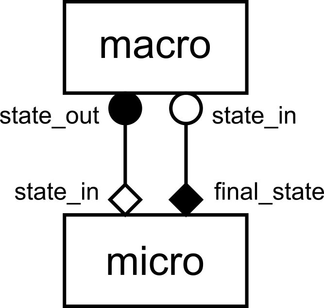

Tutorial with Python
====================

In this section, we'll look at a few examples of how to use MUSCLE 3 to create a
multiscale simulation in Python.

`The source code for these examples is here
<https://github.com/multiscale/muscle3/tree/master/docs/source/examples/python>`_.
You can also clone the repository or download the source (see the C++ part of
the Installation section) and go to ``docs/source/examples/python``, or
copy-paste the code from here. If you're cloning, be sure to use the ``master``
branch. ``develop`` may have changes incompatible with the current release.

The easiest way to get set up is to create a virtualenv and then install MUSCLE
3 and the additional requirements inside it. Running ``make`` in the
``examples/python`` directory will make a virtual environment in
``examples/python/build/venv``:

.. code-block:: bash

  examples/python$ make

  # or by hand:
  examples/python$ python3 -m venv build/venv              # create venv
  examples/python$ . build/venv/bin/activate               # activate it
  examples/python$ pip3 install -r requirements.txt        # install dependencies

If you get an error message saying amongst others ``error: invalid command
'bdist_wheel'``, try running ``pip3 install wheel`` and then ``pip3 install -r
requirements.txt`` again to fix it. Or if you have administrator rights,
``apt-get install python3-wheel`` will also work, and fix this issue for the
whole system.

You can then run the example described below by activating the virtual
environment, and then running the file ``reaction_diffusion.py``:

.. code-block:: bash

  examples/python$ . build/venv/bin/activate
  exmaples/python$ python3 reaction_diffusion.py

Our first example is a reaction-diffusion model on a 1D grid. It consists of a
reaction model coupled to a diffusion model in a macro-micro fashion, with the
diffusion model the macro model and the reaction model the micro model. In a
macro-micro model with timescale separation, the micro model does a full run (of
many timesteps) for every timestep of the macro model. Thus, the macro model
effectively calls the micro model before each state update, sending it the
current state and using its output as an input for the state update operation.

Here's how to implement that with MUSCLE 3. (A detailed explanation follows
below the code.)

.. literalinclude:: examples/python/reaction_diffusion.py
  :caption: ``docs/source/examples/python/reaction_diffusion.py``
  :language: python

Let's take it step by step.

Importing headers
-----------------

.. code-block:: python

  import logging
  import os

  import numpy as np

  from libmuscle import Grid, Instance, Message
  from libmuscle.runner import run_simulation
  from ymmsl import (
          Component, Conduit, Configuration, Model, Operator, Ports, Settings)

As usual, we begin by importing some required libraries. OrderedDict and logging
come from the Python standard library, and NumPy provides matrix math
functionality. From libmuscle, we import :class:`libmuscle.Instance`, which will
represent a model instance in the larger simulation, and
:class:`libmuscle.Message`, which represents a MUSCLE message as passed between
instances.  The :func:`libmuscle.run_simulation` function allows us to run a
complete simulation from a single Python file, as opposed to having separate
implementations started by the manager.

In order to describe our model, we use a number of definitions from
`ymmsl-python`. More about those below.

A simple submodel
-----------------

Next is the reaction model. It is defined as a single Python function that takes
no arguments and returns nothing. (Note that this code uses type annotations to
show the types of function arguments and return values. These are ignored by the
Python interpreter, and also by MUSCLE 3, so you don't have to use them if you
don't want to.)

The first step in a MUSCLE model is to create an :class:`libmuscle.Instance`
object:

.. code-block:: python

  def reaction() -> None:
      instance = Instance({
              Operator.F_INIT: ['initial_state'],       # list of float
              Operator.O_F: ['final_state']})           # list of float
      # ...

The constructor takes a single argument, a dictionary that maps operators to
lists of ports. Ports are used by submodels to exchange messages with the
outside world. Ports can be input ports or output ports, but not both at the
same time. In this model, we have a single input port named ``initial_state``
that will receive an initial state at the beginning of the model run, and a
single output port named ``final_state`` that sends the final state of the
reaction simulation to the rest of the simulation. Note that the type of data
that is sent is documented in a comment. This is obviously not required, but it
makes life a lot easier if someone else needs to use the code or you haven't
looked at it for a while, so it's highly recommended. Available types are
described below.

The operators will become clear shortly.

The reuse loop
--------------

.. code-block:: python

  while instance.reuse_instance():
      # F_INIT
      # State update loop
      # O_F

Now that we have an :class:`libmuscle.Instance` object, we can start the *reuse
loop*. In multiscale simulations, submodels often have to run multiple times,
for instance because they're used as a micro model or because they are part of
an ensemble that cannot be completely parallelised. In order to accomplish
this, the entire model is wrapped into a loop. Exactly when this loop ends
depends on the behaviour of the whole model, and is not easy to determine, but
fortunately MUSCLE will do that for us if we call the
:meth:`libmuscle.Instance.reuse_instance` method.

Initialisation: Settings and receiving messages
-----------------------------------------------

.. code-block:: python

  while instance.reuse_instance():
      # F_INIT
      t_max = instance.get_setting('t_max', 'float')
      dt = instance.get_setting('dt', 'float')
      k = instance.get_setting('k', 'float')

      msg = instance.receive('initial_state')
      U = msg.data.array.copy()

      t_cur = msg.timestamp

Next is the first part of the model, in which the state is initialised. Pretty
much every model has such an initialisation phase at the beginning. In MUSCLE's
abstract idea of what a submodel does, the Submodel Execution Loop, this part of
the code is referred to as the F_INIT operator. Here, we ask MUSCLE for the
values of some settings that we're going to need later, in particular the total
time to simulate, the time step to use, and the model parameter ``k``. The
second argument, which specifies the expected type, is optional. If it's given,
MUSCLE will check that the user specified a value of the correct type, and if
not raise an exception. Note that getting settings needs to happen *within* the
reuse loop; doing it before can lead to incorrect results.

After getting our settings, we receive the initial state on the
``initial_state`` port. Note that we have declared that port above, and declared
it to be associated with the F_INIT operator. During F_INIT, messages can only
be received, not sent, so that declaration makes ``initial_state`` a receiving
port.

The message that we receive contains several bits of information. Here, we are
interested in the ``data`` attribute, which we assume to be a grid of floats
containing our initial state, which we'll call ``U``. The ``msg.data`` attribute
holds an object of type :class:`libmuscle.Grid`, which holds a read-only NumPy
array and optionally a list of index names. Here, we take the array and make a
copy of it for ``U``, so that we can modify ``U`` in our upcoming state update.
Without calling ``.copy()``, ``U`` would end up pointing to the same read-only
array, and we'd get an error message if we tried to modify it.

Finally, we'll initialise our simulation time to the time at which that state is
valid, which is contained in the ``timestamp`` attribute. This is a
double precision float containing the number of simulated (not wall-clock)
seconds since the whole simulation started.

The state update loop
---------------------

.. code-block:: python

  # F_INIT

  while t_cur + dt < msg.timestamp + t_max:
      # O_I

      # S
      U += k * U * dt
      t_cur += dt

  # O_F

Having initialised the model, it is now time for the state update loop. This
code should look familiar: we loop until we reach our maximum time (now
relative to when we started), and on each iteration update the state according
to the model equation. This state update is called operator S in the Submodel
Execution Loop, and in this model, it is determined entirely by the current
state. Since no information from outside is needed, we do not receive any
messages, and in our :class:`libmuscle.Instance` declaration above, we did not
declare any ports associated with ``Operator.S``.

The Submodel Execution Loop specifies another operator within the state update
loop, which is called O_I and comes before S. This operator provides for
observations of intermediate states. In other words, here is where you can send
a message to the outside world with (part of) the current state. In this case,
the O_I operator is empty; we're not sending anything. While this makes the
model a bit less reusable (it won't work as a macro-model like this), it is
perfectly legal. MUSCLE tries hard to let you break in places where it doesn't
break anything, and where it does it tries to give a helpful error message.

Sending the final result
------------------------

.. code-block:: python

  # O_F
  instance.send('final_state', Message(t_cur, None, Grid(U, ['x'])))

After the update loop is done, the model has arrived at its final state. We
finish up by sharing that final state with the outside world, by sending it on
the ``final_state`` port. The part of the code after the state update loop (but
still within the reuse loop) is known as the O_F operator in the Submodel
Execution Loop, so that is where we declared this port to live in our
:class:`libmuscle.Instance` declaration above.

To send a message, we specify the port on which to send (which must match the
declaration by name and operator), and a Message object containing the current
simulation time and the current state, converted to a Grid. The optional second
parameter is a second timestamp, which will be discussed below, and is set to
``None`` here.

MUSCLE 3 uses `MessagePack <https://msgpack.org>`_ to encode messages between
models. MessagePack is a binary encoding format which can be thought of as a
binary version of JSON. That means that the message can be an integer, float,
bool, string, or a list or dictionary containing such, and MUSCLE 3 additionally
supports NumPy arrays and byte arrays. Like with JSON, these can be nested, so
you can send a dictionary containing lists of floats for example.

MessagePack is self-describing, so you can inspect the received message to find
out what you were sent. In most cases, all data you send on a particular
port will be of the same type, and you will expect data in a particular format
when receiving. We intentionally chose a self-describing format to keep you from
having to change a definition and recompile bindings every time you change what
you send. That does have a downside in that it makes it more difficult to see
what should be sent to someone elses submodel. So please make sure that you
document, for each port, which data type you're expecting or sending! Your
future colleagues (and possibly your future self) will thank you.

MessagePack is an extensible format, and since sending grids is very common in
these kinds of models MUSCLE 3 supports sending NumPy arrays directly. Here, we
wrap our array U into a :class:`libmuscle.Grid` object, so that we can add the
name of the dimensions. In this case there's only one, and ``x`` is not very
descriptive, so we could have also passed ``U`` directly, in which case MUSCLE
would have sent a :class:`libmuscle.Grid` without index names automatically.

Note that grids (and NumPy arrays) are much more efficient than lists and
dictionaries. If you have a lot of data to send, then you should use those as
much as possible. For example, a set of agents is best sent as a dictionary of
1D NumPy arrays, with one array/grid for each attribute. A list of dictionaries
will be quite a bit slower and use a lot more memory, but it should work up to
a million or so objects.

Finally, if you want to use your own encoding, you can just send a ``bytes``
object, which will be transmitted as-is, with minimal overhead.

This concludes our reaction model. As you can see, submodels that are used with
MUSCLE 3 very much look like they would without. With one additional variable,
one extra loop, and a few send and receive statements you're ready to connect
your model into a larger simulation.

Message timestamps
------------------

In order to make a coupled simulation, we need at least two models. The second
model here is the diffusion model. Its overall structure is the same as for the
reaction model, but it has a few additional features. The first of these is an
O_I operator.

.. code-block:: python

  # O_I
  t_next = t_cur + dt
  if t_next + dt > t_max:
      t_next = None
  cur_state_msg = Message(t_cur, t_next, Grid(U, ['x']))
  instance.send('state_out', cur_state_msg)

Since the diffusion model is the macro-submodel in this model, it needs to send
its state to the outside world on every timestep. This is done in the O_I
operator. The message contains the state, converted to a
:class:`libmuscle.Grid`, and it is sent on the ``state_out`` port, which was
declared for the O_I operator when we made the :class:`libmuscle.Instance` for
this model. The message is sent with the current simulation time, and a second
timestamp that gives the simulation time for the next message that will be sent
on this port. Since our time steps are fixed, this is easy to calculate. We do
need to take care to send ``None`` if this is the final message on this port
however, since there won't be another message in that case.

This deserves a bit more explanation. First, MUSCLE 3 does not use the
timestamps that are attached to the messages for anything, and in this
particular case, always sending ``None`` for the second timestamp will work
fine.  These timestamps are necessary if two submodels with timescale overlap
need to be connected together. In that case, both models will run concurrently,
and they will exchange messages between their O_I and S operators.

If their time scales (step sizes) do not match exactly, then the number of
messages sent by one submodel does not match the number of messages that the
other submodel is trying to receive, and one will end up waiting for the other,
bringing the whole simulation to a halt. To avoid this, an intermediate
component needs to be inserted, which interpolates the messages. In order to
send and receive in the correct order, this component needs to know when the
next message will be sent, and that is when the second timestamp is required.

So, to make your submodel more generically usable, it's good to set the second
timestamp. But perhaps you're trying to connect an existing codebase that uses
varying timestep sizes, and it's not easy to get it to tell you how big the
next timestep will be. In that case, if you're not doing time scale overlap,
just put ``None`` there and move on to the next problem, it'll work just fine.

Receiving messages with a default
---------------------------------

.. code-block:: python

  # S
  msg = instance.receive('state_in', default=cur_state_msg)
  if msg.timestamp > t_cur + dt:
      logger.warning('Received a message from the future!')
  np.copyto(U, msg.data.array)

The diffusion model being the macro-model, it will need to receive input for its
state update from the micro-model, which it does by calling
:meth:`libmuscle.Instance.receive`. This receive is a bit special in that we
are passing a default message. The default message is returned if this port is
not connected. We are cleverly passing the message containing our current
state, so that if this port is not connected, the model continues from its
current state. Since MUSCLE 3 will simply ignore a send command on a
disconnected port, this makes it possible to run the diffusion model without a
micro-model attached.

Of course, a sensible default value will not be available in all cases, but if
there is one, using it like this is a good idea.

Next, we check that we didn't receive a message from the future. This can happen
if the micro-model runs for longer than our macro-model timestep. In this case,
the number of steps is fixed, so that this warning will never be emitted.
However, if the micro-model runs until it detects convergence, then it can
happen that it runs for longer than the timestep of the macro-model, and that
would indicate that there is no timescale separation anymore. In that case, the
result could be wrong, and a warning is appropriate.

Then, we copy the received data into our state array. The received
:class:`libmuscle.Grid` object contains a read-only array, and just writing ``U
= msg.data.array`` would discard the state we have in ``U``, and instead make
the variable ``U`` refer to the received read-only array. We would then get an
error message when trying to update the state. The ``np.copyto`` function
instead copies the (read-only) contents of ``msg.data.array`` into the existing
(writable) array referred to by ``U``. This way, we can do our state update, and
it's also a bit more efficient than reallocating memory all the time.

The S operator here calls the ``laplacian()`` function (not shown). There is no
requirement for a submodel to be a single function, you can split it up, call
library functions, and so on. There has to be a top-level function however if
you want to run more than one submodel in a single Python program. Also, you
cannot share any data with other components, other than by sending and receiving
messages. In particular, you can't use global variables to communicate between
models. This is intentional, because it doesn't work if you're running as
separate programs on different computers.

Connecting it all together
--------------------------

With both models defined, we now need to instruct MUSCLE 3 on how to connect
them together. We do this by creating an object of type
``ymmsl.Configuration``, which contains all the information needed to run the
simulation. It often helps to draw a diagram first:

  gMMSL diagram of the reaction-diffusion model.

This is a gMMSL diagram of the reaction-diffusion model. It shows that there
are two components named ``macro`` and ``micro``. A conduit connects port
``state_out`` on ``macro`` to ``state_in`` on ``micro``. The symbols at the
ends of the conduit show the operators that the ports belong to, O_I for
``macro.state_out`` and F_INIT for ``micro.state_in``. Another conduit connects
port ``micro.final_state`` (O_F) to ``macro.state_in`` (S).

Note that there's a mnemonic here: Operators O_I and S, which are within the
state update loop, have a circular symbol, while F_INIT and O_F use a diamond
shape. Also, filled symbols designate ports on which messages are sent, while
open symbols designate receiving ports. We can therefore see that for each state
update, ``macro`` will send on ``state_out``, after which ``micro`` will do a
full run and send its final result as input for the next state update of
``macro``.

Since diagrams aren't valid Python, we need an alternative way of describing
this model in our code. For this, we use the ``ymmsl`` library to create a set
of objects that form a description.

.. code-block:: python

    components = [
            Component(
                    'macro', 'diffusion', 1,
                    Ports(o_i=['state_out'], s=['state_in'])),
            Component(
                    'micro', 'reaction', 1,
                    Ports(f_init['initial_state'], o_f=['final_state']))]

First, we describe the two components in this model. Components can be
submodels, or helper components that convert data, control the simulation, or
otherwise implement required non-model functionality. In this simple example,
we only have two submodels: one named ``macro`` and one named ``micro``. Macro
is implemented by an implementation named ``diffusion``, while micro is
implemented by an implementation named ``reaction``.

The name of a component is used by MUSCLE as an address for communication
between the models. The implementation name is intended for use by a launcher,
which would start the corresponding program to create an instance of a
component.  It is these instances that form the actual running simulation.

.. code-block:: python

    conduits = [
            Conduit('macro.state_out', 'micro.initial_state'),
            Conduit('micro.final_state', 'macro.state_in')]

    model = Model('reaction_diffusion', components, conduits)

Next, we need to connect the components together. This is done by conduits,
which have a sender and a receiver. Here, we connect sending port ``state_out``
on component ``macro`` to receiving port ``initial_state`` on component
``micro``. Note that these ports are actually defined in the implementations,
and not in this configuration file, and they are referred to here.

The components and the conduits together form a ``Model``, which has a name and
those two sets of objects.

.. code-block:: python

    settings = Settings({
        'micro.t_max': 2.469136e-6,
        'micro.dt': 2.469136e-8,
        'macro.t_max': 1.234568e-4,
        'macro.dt': 2.469136e-6,
        'x_max': 1.01,
        'dx': 0.01,
        'k': -4.05e4,     # reaction parameter
        'd': 4.05e-2      # diffusion parameter
        })

    configuration = Configuration(model, settings)

Finally, we define the settings for our simulation by constructing a
:class:`ymmsl.Settings` object from a dictionary. Note that there are two
duplicated names between the two models: ``t_max`` and ``dt``. With MUSCLE 3,
you can create a global setting with that name to set it to the same value
everywhere (handy for settings that are used by multiple components), or you can
prepend the name of the component to set the value for a specific one. Specific
settings go before generic ones, so if you specify both ``micro.t_max`` and
``t_max``, then the ``micro`` component will use ``micro.t_max`` and all others
will use ``t_max``.

The model and the settings are combined into a Configuration, which contains
everything needed to run the simulation. A Configuration object is also the
Python-side equivalent to a yMMSL YAML file.

Launching the simulation
------------------------

There are two ways of launching a MUSCLE 3 simulation: locally in a Python
script (as we do here), and by having the MUSCLE Manager start a set of programs
implementing the components. The first option puts everything into one or more
Python files and is suitable for testing, experimentation, learning, and small
scale production use on a local machine. The second option, described in the
`Distributed execution`_ section, is needed for larger simulations possibly on
HPC machines, or if any of the components is not written in Python.

Here, we're learning, and we have all our models in a Python file already, so
we'll use the first option to tie them together. This uses the
:func:`libmuscle.run_simulation` function:

.. code-block:: python

  implementations = {'diffusion': diffusion, 'reaction': reaction}
  run_simulation(configuration, implementations)

Here, we make a dictionary that maps implementation names to the corresponding
Python functions. We then pass the configuration and the implementations to
:func:`libmuscle.run_simulation`, which will start the muscle_manager and the
implementations, and then wait for the simulation to finish.

Note that this will actually fork off a separate process for the manager and for
each implementation, so that this is a real distributed simulation, albeit on a
single machine. That makes this mode of operation a more realistic test case
for a real distributed run on an HPC machine, smoothing the transition to larger
compute resources.

If you run the script, e.g. using

.. code-block:: bash

  (venv) python$ python3 reaction_diffusion.py

it will pop up a plot showing the state of the simulated system over time. If
you are on a machine without graphics support, then you will get an error
message if you run the above, saying something like ``couldn't connect to
display``. In that case, try the below command to disable graphical output:

.. code-block:: bash

  (venv) python$ DONTPLOT=1 python3 reaction_diffusion.py

Log output
----------

Logging for the models is handled by the normal Python logging framework, which
we configured in ``__main__``, and which prints log messages on the screen.
Because that gets really difficult to follow with multiple models running
simultaneously, MUSCLE's ``run_simulation`` automatically redirects each model's
output to a separate file. After running the simulation, you will find three log
files in the current directory: ``muscle3_manager.log``, ``muscle3.macro.log``
and ``muscle3.micro.log``. The first logs the simulation from the perspective of
the MUSCLE Manager, the others do the same for each submodel. Have a look to see
what really happened when running the simulation!

By default, Python (and MUSCLE 3) only logs messages at level ``WARNING`` or
higher. To be able to see better what's going on, we configure it to also log
messages at ``INFO`` level:

.. code-block:: python

  logging.basicConfig()
  logging.getLogger().setLevel(logging.INFO)

For even more detail, you can set the log level to ``logging.DEBUG``, but be
aware that ``matplotlib`` outputs rather a lot of information at that level. So
it's better to set only ``libmuscle`` to that level, by adding a line to the
above:

.. code-block:: python

  logging.basicConfig()
  logging.getLogger().setLevel(logging.INFO)
  logging.getLogger('libmuscle').setLevel(logging.DEBUG)

This will produce a lot more output, including all sorts of technical details
that you probably don't want to be bothered with at this point. Set it to
``logging.WARNING`` and ``libmuscle`` will be nice and quiet unless something
goes wrong.

The minimum log level for sending a message to the central log file
(``muscle_manager.log``) is set by the ``muscle_remote_log_level`` setting. For
example, if you change the example to read

.. code-block:: python

    settings = Settings(OrderedDict([
                ('muscle_remote_log_level', 'DEBUG'),
                ('micro.t_max', 2.469136e-6),
                ('micro.dt', 2.469136e-8),
                ('macro.t_max', 1.234568e-4),
                ('macro.dt', 2.469136e-6),
                ('x_max', 1.01),
                ('dx', 0.01),
                ('k', -4.05e4),     # reaction parameter
                ('d', 4.05e-2)      # diffusion parameter
                ]))

then all log messages at level ``DEBUG`` or up from all submodels will be sent
to the manager log. Note that the local log level will always be kept at least
as low as the remote one, so the above also sets the local level to ``DEBUG``.
As a result, those debug messages will also be in the submodel log files.

Unfortunately, ``matplotlib`` produces quite a mess at ``DEBUG`` level, so you
may want to quiet it down a bit:

.. code-block:: python

  logging.basicConfig()
  logging.getLogger().setLevel(logging.INFO)
  logging.getLogger('libmuscle').setLevel(logging.DEBUG)
  logging.getLogger('matplotlib').setLevel(logging.WARNING)

As you may have noticed if you ran with Matplotlib output enabled, logging to
the manager does slow down the simulation if you have many log statements. So
it's good to use this to debug and to learn, but do increase the level again for
production runs.

Finally, ``muscle_local_log_level`` can be used to set the local log level, but
note that this only affects the ``libmuscle`` library. If you want to be able to
change the log output of your model as well via a setting, you'll have to read
the setting (or another setting with a different name) and configure logging
accordingly yourself.
